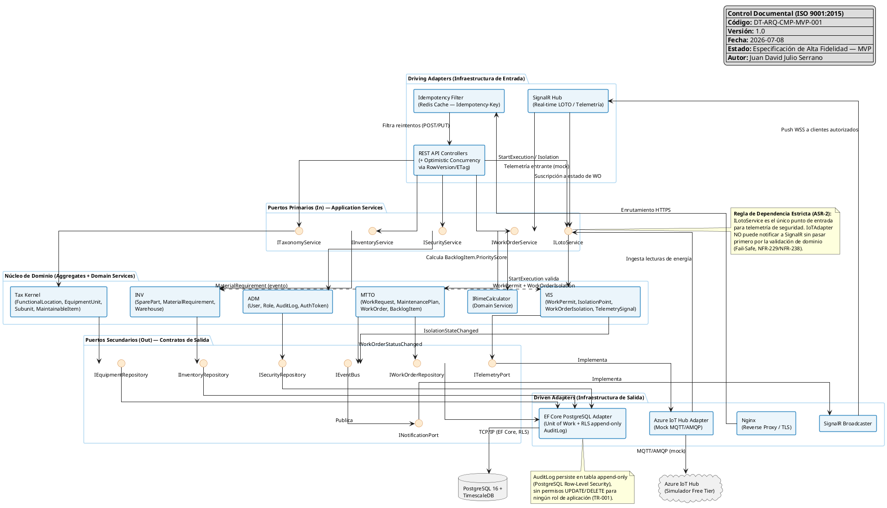

# Especificación Técnica de Componentes — Backend MVP "Gemelo Digital EAM"

## 0. Alcance y Restricciones

Esta especificación cubre **exclusivamente** las historias `MUST` / prioridad `Alta` referenciadas en `ADR-001` (visor 2D), `ADR-003` (auditoría evidente de manipulación), el ERD, el modelo de dominio y los ASRs. No se introduce ninguna tecnología no documentada en `deployment-model.puml` / `component-model.puml`: .NET 10, PostgreSQL 16 + TimescaleDB, Redis (cache de idempotencia), Azure IoT Hub (simulador MQTT/AMQP), Nginx, SignalR.

---

## SECCIÓN 1: Diagrama de Componentes Hexagonales del MVP (PlantUML)

---

## SECCIÓN 2: Especificación de Componentes del Monolito Modular

| Componente / Capa | Estereotipo DDD / Hexagonal | Responsabilidad Técnica MVP | Mapeo Tecnológico (.NET 10) |
|---|---|---|---|
| `Nginx (Reverse Proxy)` | Driving Adapter (Infraestructura) | Terminación TLS y enrutamiento hacia el contenedor del backend monolítico. | Contenedor Docker independiente (no gestionado por .NET). |
| `Idempotency Filter` | Driving Adapter | Intercepta solicitudes `POST`/`PUT` con encabezado `Idempotency-Key`, evitando reprocesamiento de operaciones offline reenviadas por el cliente móvil tras reconexión (TR-007). | `IActionFilter` + `IDistributedCache` (Redis). |
| `REST API Controllers` | Driving Adapter | Expone los Puertos Primarios como endpoints HTTP; aplica concurrencia optimista mediante `RowVersion`/`ETag` para evitar sobrescritura silenciosa en ediciones concurrentes de `WorkOrder`/`EquipmentUnit`. | `ASP.NET Core Minimal APIs` / Controllers + middleware `[ConcurrencyCheck]`. |
| `SignalR Hub (Real-time LOTO)` | Driving Adapter | Canal persistente bidireccional para telemetría de energía y cambios de estado de `WorkOrderIsolation`; degrada a polling si el canal cae (TR-010-NFR-436). | `Microsoft.AspNetCore.SignalR.Hub`. |
| `Módulo TAX: ITaxonomyService` | Application Service (Puerto In) | Orquesta casos de uso de jerarquía ISO 14224: alta/baja de `FunctionalLocation`, instalación/desinstalación de `EquipmentUnit`, validación de ciclos y profundidad (TR-008). | Interfaz C# + implementación `TaxonomyAppService`. |
| `Módulo MTTO: IWorkOrderService` | Application Service (Puerto In) | Orquesta ciclo de vida de `WorkRequest` → `WorkOrder`: programación, ejecución (con validación LOTO delegada a VIS), cierre administrativo y reporte de fallas. | Interfaz C# + `WorkOrderAppService`, `IHostedService` para disparo de `MaintenancePlan` (Cron/Quartz.NET). |
| `Módulo INV: IInventoryService` | Application Service (Puerto In) | Orquesta reservas/consumos de `SparePart`, materialización de `MaterialRequirement` y transiciones de `EquipmentUnit` hacia estado "Almacén"/"Taller" (Asset Swap). | Interfaz C# + `InventoryAppService`. |
| `Módulo ADM: ISecurityService` | Application Service (Puerto In) | Autenticación de credenciales, emisión de tokens de sesión (8h), validación RBAC por endpoint y escritura de `AuditLog`. | Interfaz C# + `SecurityAppService`, `ASP.NET Core Identity` (adaptado) + `JwtBearer`. |
| `Módulo VIS: ILotoService` | Application Service (Puerto In) | Coordina `WorkPermit.Approve()`, verificación secuencial de `IsolationPoint` y bloqueo/desbloqueo de `WorkOrder.StartExecution()` según telemetría de energía (Fail-Safe). | Interfaz C# + `LotoAppService`. |
| `Tax Kernel (Dominio)` | Aggregate Roots | `FunctionalLocation`, `EquipmentClass`, `EquipmentUnit` gobiernan invariantes de unicidad, boundaries y jerarquía de 9 niveles. | Clases de dominio POCO, sin dependencias de infraestructura (Núcleo Hexagonal). |
| `IRimeCalculator` | Domain Service | Calcula `RIME Score = Criticidad(1–10) × ClaseDeTrabajo(1–10)` de forma determinística e inyectable, desacoplando el algoritmo de `BacklogItem.UpdatePriorityScore()`. | Interfaz `IRimeCalculator` + `RimeCalculatorService` (Strategy Pattern, ADR-002). |
| `MaintenancePlan (Dominio)` | Aggregate Root | Expone `CalculateNextDueDate()` (cadencia calendario) y `CalculateNextTriggerLimit(currentUsage)` (cadencia por uso/telemetría), soportando ambas variables (`IntervalValue`, `NextTriggerLimit`) sin bifurcar el modelo (MTTO-001, MTTO-023). | Clase de dominio; `IntervalValue`/`NextTriggerLimit` como `Decimal(12,2)` de alta precisión (evita drift de redondeo, TR-008-NFR conexo). |
| `WorkOrderIsolation (Dominio)` | Entidad Asociativa (Tabla intermedia) | Materializa la verificación activa N:M entre `WorkOrder` e `IsolationPoint`; cada fila captura `IsIsolated` e `IsolatedAt` de forma independiente por punto de corte, habilitando el checklist secuencial obligatorio (FR-228). | Entidad EF Core con clave compuesta `(WorkOrderId, IsolationPointId)`. |
| `Warehouse (Dominio)` | Aggregate Root (Catálogo) | Resguarda física y lógicamente activos serializados desmontados (`EquipmentUnit.warehouse_id`) durante rotación de activos (Asset Swap, INV-025), preservando el historial de la `FunctionalLocation` de origen. | Entidad de referencia; sin comportamiento mutador propio (Ledger/Reference Data). |
| `EF Core PostgreSQL Adapter` | Driven Adapter | Implementa los puertos secundarios (`IEquipmentRepository`, `IWorkOrderRepository`, `IInventoryRepository`, `ISecurityRepository`) mediante Unit of Work; enruta `AuditLog` a tabla append-only con Row-Level Security (sin permisos `UPDATE`/`DELETE` para ningún rol de aplicación). | `DbContext` + `IRepository<T>` genérico; `EF Core Interceptor` (`SaveChangesInterceptor`) para inyectar auditoría automática (TR-001). |
| `Azure IoT Hub Adapter` | Driven Adapter | Implementa `ITelemetryPort`; para el MVP consume un simulador (mock) de lecturas MQTT/AMQP de energía y uso acumulado, emulando hardware real sin reescritura de lógica de seguridad (VIS-011, ASR-2). | `IHostedService` (background listener) + cliente `Microsoft.Azure.Devices.Client`. |
| `SignalR Broadcaster` | Driven Adapter | Implementa `INotificationPort`; publica eventos de dominio (`IsolationStateChanged`, `WorkOrderStatusChanged`) a clientes conectados, filtrando por rol autorizado (TR-010-FR-433). | `IHubContext<T>`. |
| `IEventBus` | Puerto Secundario (Out) | Desacopla módulos de dominio: publica eventos (`WorkRequestPromoted`, `MaintenancePlanTriggered`, `IsolationStateChanged`) para que otros módulos reaccionen sin acceso directo a tablas ajenas (regla de "sin tablas compartidas"). | Implementación in-process MVP (`MediatR INotificationHandler`), sustituible por broker externo en fases posteriores sin romper el contrato. |

---

## SECCIÓN 3: Índice de Trazabilidad de Puertos, Interfaces y Requisitos

| Módulo / Puerto | Firma del Método y Parámetros | Historia / Requisito Satisfecho | Validación de Invariante de Seguridad / Negocio |
|---|---|---|---|
| TAX / `ITaxonomyService` (In) | `InstallEquipment(Guid functionalLocationId, Guid equipmentUnitId): void` | [[INV-025]], FR-184, FR-185 | Valida que la ubicación funcional no tenga ya un equipo instalado (unicidad 1 slot–1 activo) y que el equipo de reemplazo esté en estado "Disponible"/"Stock" antes de vincular (FR-593). |
| TAX / `ITaxonomyService` (In) | `UninstallEquipment(Guid functionalLocationId, string targetState): void` | [[INV-025]], FR-591, FR-592 | Ejecuta commit atómico único: desvincula el activo y transiciona su estado a "En Reparación"/"Dañado"/"Almacén" en la misma transacción de base de datos (NFR-596). |
| TAX / `ITaxonomyService` (In) | `ReorganizeTree(Guid locationId, Guid newParentId): void` | [[INV-027]], FR-162, NFR-167 | Valida ausencia de ciclos (un nodo no puede ser padre de su propio ancestro, TR-008-FR-417) y verifica coherencia de `HierarchyLevel` antes de aplicar el movimiento. |
| TAX / `IEquipmentRepository` (Out) | `GetHierarchyPathAsync(Guid assetId): Task<IReadOnlyList<FunctionalLocation>>` | TR-008-FR-416 | Debe garantizar camino completo e ininterrumpido desde Nivel 1 hasta el activo consultado; respuesta en <500ms (TR-008-NFR-419). |
| MTTO / `IWorkOrderService` (In) | `PromoteToWorkOrder(Guid workRequestId): Guid` | Soporte Transversal (WorkRequest), MTTO-026 | Recalcula el `RIME Score` vía `IRimeCalculator` antes de admitir la solicitud al backlog; rechaza si `WorkClass` no está definido (FR-059). |
| MTTO / `IWorkOrderService` (In) | `UpdatePriorityScore(Guid backlogItemId): void` | [[MTTO-026]], FR-060, NFR-074 | Invoca `IRimeCalculator.Calculate(criticality, workClass)`; el motor debe ser determinístico — misma entrada produce idéntico score en todo el sistema (NFR-074). |
| MTTO / `IWorkOrderService` (In) | `CalculateNextTriggerLimit(Guid maintenancePlanId, decimal currentUsage): void` | [[MTTO-023]], FR-583, FR-584 | Rechaza lecturas de telemetría inferiores al acumulado histórico (decremento de contador); mantiene el último valor válido y genera alerta de inconsistencia. |
| MTTO / `IWorkOrderService` (In) | `StartExecution(Guid workOrderId, Guid technicianUserId): void` | [[VIS-011]], NFR-229 (Crítico), NFR-238 | Valida que exista `WorkPermit` en estado `APPROVED` **y** que todos los registros de `WorkOrderIsolation` asociados tengan `IsIsolated = true`. Ante pérdida de conectividad con la fuente de telemetría, asume condición de peligro y bloquea (Fail-Safe). |
| MTTO / `IWorkOrderService` (In) | `CloseAdministratively(Guid workOrderId): void` | [[MTTO-002]], FR-012 | Valida diligenciamiento completo de `FailureRecord` (taxonomía ISO 14224) y de `MaterialRequirement.ActualQuantity` antes de permitir el estado `CLOSED` (inmutable). |
| MTTO / `IWorkOrderRepository` (Out) | `SaveWithHistoryAsync(WorkOrder workOrder, string oldStatus): Task` | Soporte Transversal (`WorkOrderHistory`) | Cada transición de `CurrentStatus` debe generar automáticamente una fila en `work_order_histories` (append) dentro de la misma transacción. |
| INV / `IInventoryService` (In) | `ReserveStock(Guid sparePartId, decimal quantity): void` | [[INV-006]], FR-126 | Rechaza la reserva si `quantity` excede `QuantityOnHand - ReservedQuantity`; protege contra sobre-comprometer materiales planificados. |
| INV / `IInventoryService` (In) | `RecordConsumption(Guid workOrderId, Guid sparePartId, decimal actualQuantity): void` | [[INV-006]], FR-127 | Coordina `MaterialRequirement.RecordConsumption()` con `SparePart.IssueStock()`; no permite extraer más stock del físicamente existente. |
| INV / `IInventoryService` (In) | `SwapAsset(Guid functionalLocationId, Guid replacementEquipmentId, Guid workOrderId): void` | [[INV-025]], FR-591–FR-595 | Bloquea la operación si el activo de reemplazo está en estado distinto a "Disponible"/"Stock" o ya vinculado a otra ubicación (FR-593); registra Tag desmontado, Tag instalado, usuario, fecha y WO asociada (FR-595). |
| INV / `IInventoryRepository` (Out) | `GetAvailabilityAsync(Guid sparePartId): Task<StockSnapshot>` | TR-008 (consistencia estructural conexa) | Debe reflejar `QuantityOnHand` y `ReservedQuantity` consistentes con la última transacción confirmada (sin lecturas sucias). |
| VIS / `ILotoService` (In) | `RequireIsolation(Guid workOrderId, Guid isolationPointId): void` | [[VIS-011]], FR-228, FR-230 | Construye el checklist obligatorio; no permite marcar aislamiento total mientras existan `WorkOrderIsolation.IsIsolated = false` pendientes. |
| VIS / `ILotoService` (In) | `ConfirmZeroEnergy(Guid workOrderId): void` | [[VIS-011]], FR-230, NFR-233 | Solo se habilita cuando la fuente de telemetría (`ITelemetryPort`) confirma Energía Cero en todos los puntos de corte; latencia de reflejo <1s. |
| VIS / `ILotoService` (In) | `EvaluateEnergyState(Guid isolationPointId, decimal telemetryValue): void` | [[VIS-011]], NFR-229, NFR-237 | Si el valor excede el umbral de seguridad o es anómalo/fuera de rango, fuerza estado de peligro preventivo; el bloqueo resultante no es superable desde la UI sin confirmación explícita de supervisión. |
| VIS / `ITelemetryPort` (Out) | `SubscribeToSafetyChannel(Guid equipmentUnitId, Action<TelemetryReading> onReading): IDisposable` | [[VIS-011]], TR-010-FR-431 | Debe propagar revocaciones y lecturas de energía a <1s (sub-segundo); si el canal cae, degrada a polling (TR-010-NFR-436) y asume peligro mientras tanto. |
| VIS / `WorkPermit.Approve()` (Dominio, invocado por `ILotoService`) | `Approve(): void` | [[VIS-011]], FR-225 | Precondición operativa consumida por `WorkOrder.StartExecution()`; sin `APPROVED`, la ejecución permanece bloqueada. |
| ADM / `ISecurityService` (In) | `Authenticate(string username, string password): AuthToken` | TR-006-FR-394, TR-006-FR-395 | Emite credencial temporal con expiración ≤8h (jornada laboral); registra intento fallido incrementando contador de bloqueo (`User.RecordFailedLogin()`). |
| ADM / `ISecurityService` (In) | `Authorize(Guid userId, string module, string action): bool` | TR-006-FR-396, TR-006-NFR-401 | Verifica la matriz RBAC (`Role.AddPermission`/`RemovePermission`); debe resolver en <5ms adicionales de latencia; registra denegaciones en `AuditLog` (TR-006-FR-397). |
| ADM / `ISecurityService` (In) | `AppendAuditEntry(string entityType, string entityId, string actionType, object previousState, object newState, Guid? userId): void` | [[ADM-032]], FR-346, FR-347, TR-001-FR-361 | Escribe en tabla append-only con `RLS` activo; rechaza cualquier intento posterior de `UPDATE`/`DELETE` con error de permiso denegado, incluso para rol Administrador (TR-001-NFR-365). |
| ADM / `AuditLog.VerifyIntegrity()` (Dominio) | `VerifyIntegrity(): bool` | [[ADM-032]], FR-351 | Recalcula `IntegrityHash` y lo compara con el almacenado; ejecución periódica automática que notifica inmediatamente ante anomalía detectada. |
| ADM / `ISecurityRepository` (Out) | `GetActiveSessionsAsync(Guid userId): Task<IReadOnlyList<AuthToken>>` | TR-006-NFR-402 | Soporta mitigación de compromiso de seguridad mediante validación de estado activo del usuario en base de datos junto con expiración corta de tokens. |

---

## Notas de Cierre

- El cálculo RIME se centraliza en `IRimeCalculator` (Domain Service inyectable) para permitir su evolución de fórmula estática (`Criticidad × ClaseDeTrabajo`) a un modelo dinámico en fases posteriores sin romper el contrato de `IWorkOrderService` (ADR-002).
- `WorkOrderIsolation` se modela como entidad asociativa con estado propio (`IsIsolated`, `IsolatedAt`) precisamente porque el checklist de LOTO exige verificación secuencial e independiente por punto de corte, no una simple relación N:M sin atributos.
- Las variables `IntervalValue` y `NextTriggerLimit` de `MaintenancePlan` se mantienen como `Decimal(12,2)` para admitir planes tanto por calendario como por uso/telemetría sin bifurcar el agregado (MTTO-001 + MTTO-023 conviven en la misma raíz).
- El resguardo físico en `Warehouse` (INV-025) se limita a un rol de catálogo/referencia sin comportamiento mutador propio; toda transición de estado del activo físico ocurre en `EquipmentUnit`, preservando la separación entre historial de posición operativa (`FunctionalLocation`) e historial de la unidad física.
