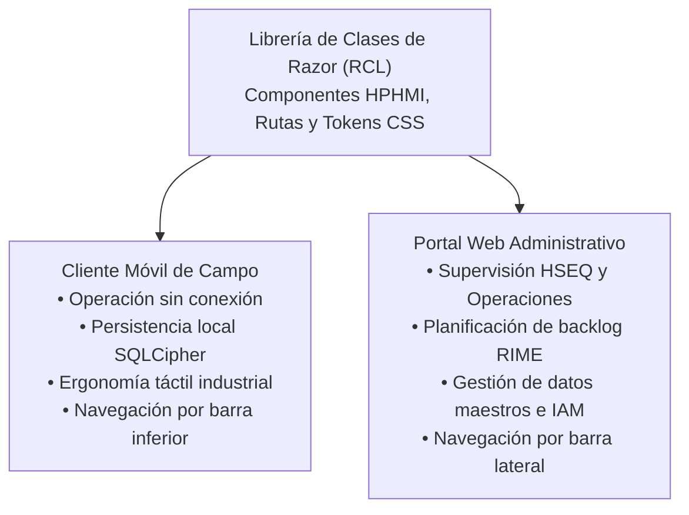
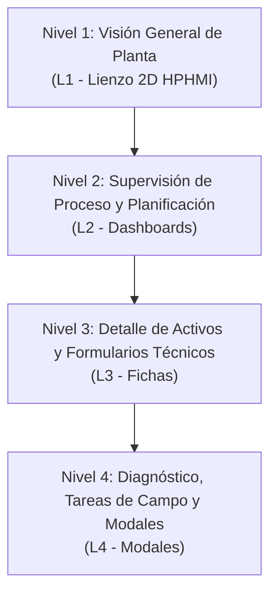
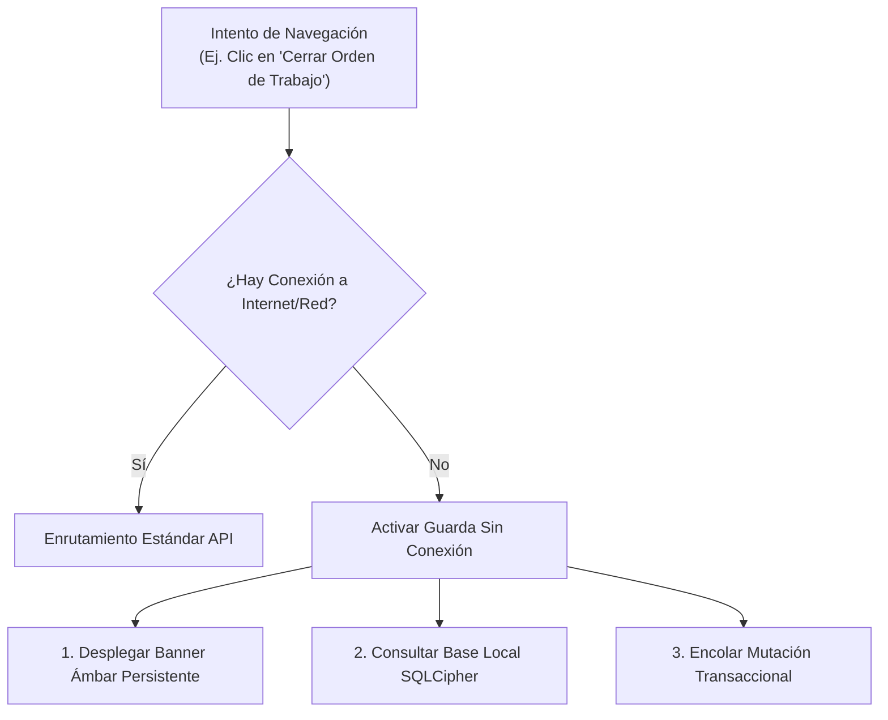
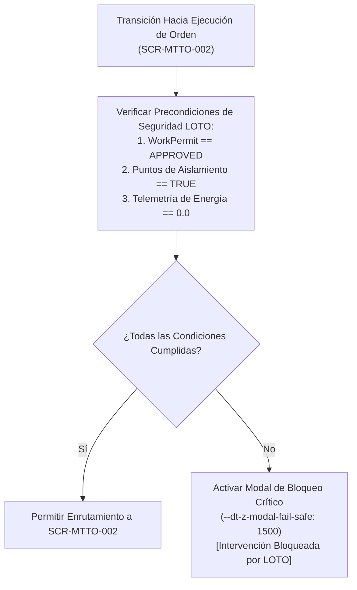

# Especificación de Arquitectura de la Información y Navegación Global

## 1. Alcance

Este documento establece la arquitectura de información y el modelo de navegación global para el Gemelo Digital EAM (DTEAM). Define la estructura jerárquica de pantallas conforme a la norma **ANSI/ISA-101.01-2015**, la distribución funcional entre plataformas de acuerdo con las decisiones de arquitectura (**[[ADR-004-DotNet-MAUI-Blazor-Hybrid|ADR-004]]**), las reglas de control de acceso basado en roles (RBAC) y las guardas de navegación críticas para la seguridad industrial y la operación en campo sin conexión.

El alcance está estrictamente delimitado a las 16 pantallas que componen la versión inicial del producto (MVP), garantizando trazabilidad total con los casos de uso aprobados y los modelos de dominio.

---

## 2. Topología de Clientes 

De acuerdo con el registro de decisión de arquitectura [[ADR-004-DotNet-MAUI-Blazor-Hybrid|ADR-004]], la interfaz de usuario se implementa mediante una arquitectura de código único compartido en una Librería de Clases de Razor (RCL), desplegada en dos entornos ejecutables diferenciados:



### 2.1. Cliente Móvil de Campo
* **Objetivo Operacional:** Ejecución de órdenes de trabajo, inspección física de activos en planta, rotación de componentes y validación de rutas de aislamiento de seguridad LOTO.
* **Patrón de Navegación:** Estructura plana optimizada para dispositivos portátiles industriales (tabletas y colectores de datos). Utiliza barra de navegación inferior de 4 accesos principales, panel lateral desplegable para herramientas secundarias y flujos de diálogo modales de pantalla completa para tareas de alto riesgo.

### 2.2. Cliente Portal Web 
* **Objetivo Operacional:** Supervisión ejecutiva HSEQ, administración del catálogo taxonómico ISO 14224, priorización del backlog de mantenimiento mediante metodología RIME, gestión de inventario e inspección de auditoría inmutable.
* **Patrón de Navegación:** Estructura jerárquica profunda para pantallas de escritorio de alta resolución (1920x1080). Utiliza barra lateral izquierda colapsable con menús multinivel, barra superior con ruta de navegación (breadcrumbs), estado de red y paneles contextuales divididos en columnas.

---

## 3. Jerarquía de Navegación

La norma **ANSI/ISA-101.01** exige la organización de interfaces industriales en cuatro niveles jerárquicos de visualización para prevenir la fatiga cognitiva y garantizar la concienciación situacional.



### 3.1. Nivel 1: Visión General de Planta (L1 - Area / Overview)
Pantallas macro que brindan una visión holística e ininterrumpida de la planta industrial. Aplican la regla HPHMI del 90% de grises neutros para resaltar únicamente condiciones de alarma.

* **`SCR-VIS-001` — Mapa de Planta 2D:** Lienzo gráfico vectorial escalable (SVG) que adopta el formato de *Simplified Plot Plan / Process Overview* en escala neutra y representa la distribución espacial de la planta, activos principales, estados de operación y capas de permisos de trabajo activos. Trazable con **[[UC-VIS-033]]**.

### 3.2. Nivel 2: Supervisión de Proceso y Planificación (L2 - Unit / Process)
Pantallas de control intermedio para supervisores, planificadores y auditores. Consolidan información agregada, árboles de jerarquía y métricas de desempeño.

* **`SCR-MTTO-004` — Tablero de Backlog RIME:** Vista de priorización objetiva de solicitudes y órdenes de trabajo basada en el producto de Criticidad del Activo por Clase de Trabajo. Trazable con **[[UC-MTTO-026]]**.
* **`SCR-INV-004` — Árbol de Ubicaciones Funcionales:** Estructura jerárquica de niveles 1 a 5 de la norma ISO 14224 para la navegación espacial del proceso. Trazable con **[[UC-INV-027]]**.
* **`SCR-ADM-001` — Matriz de Roles y Permisos (RBAC):** Panel de configuración de seguridad para asignación de privilegios de acceso y segregación de funciones. Trazable con **[[UC-ADM-013]]**.
* **`SCR-ADM-002` — Gestión de Usuarios:** Vista de administración del ciclo de vida de cuentas de usuario, estado operativo y bloqueo de seguridad. Trazable con **[[UC-ADM-014]]**.
* **`SCR-ADM-003` — Visor de Registro de Auditoría Inmutable:** Interfaz de consulta de registros históricos con verificación de dispersión criptográfica encadenada (SHA-256). Trazable con **[[UC-ADM-032]]**.

### 3.3. Nivel 3: Detalle de Activos y Formularios Técnicos (L3 - Equipment Detail)
Pantallas dedicadas a la inspección detallada de una unidad de equipo específica (Nivel 6 ISO 14224) o a la preparación formal de intervenciones de mantenimiento.

* **`SCR-VIS-002` — Tarjeta de Inspección del Activo:** Vista contextual detallada del equipo seleccionado con datos de telemetría, despiece estructural e historial reciente. Trazable con **[[UC-VIS-009]]** y **[[UC-VIS-010]]**.
* **`SCR-MTTO-001` — Formulario de Programación Preventiva:** Interfaz de configuración de planes de mantenimiento cíclicos por calendario, horas de uso o arranques. Trazable con **[[UC-MTTO-001]]**.
* **`SCR-MTTO-003` — Formulario de Programación por Telemetría:** Configuración de reglas de mantenimiento basadas en condición (CBM) impulsadas por sensores IoT. Trazable con **[[UC-MTTO-023]]**.
* **`SCR-MTTO-005` — Ficha de Límites del Activo:** Definición técnica de límites físicos del equipo (fronteras de batería) para control de costos. Trazable con **[[UC-MTTO-029]]**.
* **`SCR-INV-001` — Ficha Técnica Maestro de Equipos:** Registro maestro del activo físico con especificaciones de fabricante, fecha de compra y estado operativo. Trazable con **[[UC-INV-005]]**.
* **`SCR-INV-002` — Movimientos e Historial Kardex:** Registro transaccional de ingresos, salidas y devoluciones de materiales y repuestos asociados al activo. Trazable con **[[UC-INV-006]]**.
* **`SCR-INV-005` — Catálogo Maestro de Repuestos:** Gestión centralizada de repuestos e insumos con definición de políticas de inventario. Trazable con **[[UC-INV-031]]**.

### 3.4. Nivel 4: Diagnóstico, Tareas de Campo y Diálogos Modales (L4 - Diagnostics / Tasks)
Interfaces especializadas de ejecución atómica, verificación de seguridad en el punto de trabajo y diálogos modales interrumptivos.

* **`SCR-VIS-003` — Visor de Rutas de Aislamiento y Bloqueo LOTO:** Interfaz gráfica de verificación de puntos de aislamiento de energía antes de intervenir un equipo. Trazable con **[[UC-VIS-011]]**.
* **`SCR-MTTO-002` — Cierre Móvil de Orden de Trabajo:** Formulario de captura técnica en campo para registro de tiempos de trabajo, repuestos consumidos y códigos de falla ISO 14224. Trazable con **[[UC-MTTO-002]]**.
* **`SCR-INV-003` — Modal de Rotación de Activo (Asset Swap):** Diálogo transaccional para desmontaje físico de un equipo y montaje de una unidad de reemplazo en la ubicación funcional. Trazable con **[[UC-INV-025]]**.

---

## 4. Árbol de Arquitectura de la Información

### 4.1. Estructura de Navegación — Cliente Móvil

```text
├── [Barra de Navegación Inferior]
│   ├── 1.0 Planta (L1)
│   │   └── SCR-VIS-001: Mapa de Planta 2D
│   │       ├── Acceso a SCR-VIS-002: Tarjeta de Inspección del Activo (L3)
│   │       └── Acceso a SCR-VIS-003: Visor de Rutas de Aislamiento LOTO (L4)
│   ├── 2.0 Mis Órdenes (L2)
│   │   └── Lista de Órdenes de Trabajo Asignadas
│   │       ├── SCR-MTTO-002: Cierre Móvil de Orden de Trabajo (L4)
│   │       └── SCR-VIS-003: Visor de Rutas de Aislamiento LOTO (L4)
│   ├── 3.0 Activos (L2)
│   │   └── Búsqueda por Tag / Escaneo de Código QR
│   │       ├── SCR-INV-001: Ficha Técnica Maestro de Equipos (L3)
│   │       └── SCR-INV-003: Modal de Rotación de Activo [Asset Swap] (L4)
│   └── 4.0 Sincronización (L2)
│       └── Estado de Cola Transaccional Sin Conexión
└── [Menú Lateral Desplegable - Drawer]
    ├── 5.1 SCR-MTTO-005: Ficha de Límites del Activo (L3)
    ├── 5.2 SCR-INV-002: Movimientos e Historial Kardex (L3)
    └── 5.3 Perfil de Usuario y Estado de Licencia Criptográfica
```

### 4.2. Estructura de Navegación — Cliente Portal Web

```text
└── [Barra Lateral Principal - Sidebar]
    ├── 1.0 Gemelo Digital & Operaciones
    │   ├── 1.1 SCR-VIS-001: Mapa de Planta 2D (L1)
    │   ├── 1.2 SCR-VIS-002: Tarjeta de Inspección del Activo (L3)
    │   └── 1.3 SCR-VIS-003: Visor de Rutas de Aislamiento LOTO (L4)
    ├── 2.0 Mantenimiento & Confiabilidad
    │   ├── 2.1 SCR-MTTO-004: Tablero de Backlog RIME (L2)
    │   ├── 2.2 SCR-MTTO-001: Formulario de Programación Preventiva (L3)
    │   ├── 2.3 SCR-MTTO-003: Formulario de Programación por Telemetría (L3)
    │   ├── 2.4 SCR-MTTO-005: Ficha de Límites del Activo (L3)
    │   └── 2.5 SCR-MTTO-002: Cierre Móvil de Orden de Trabajo [Vista Registro] (L4)
    ├── 3.0 Inventario & Taxonomía
    │   ├── 3.1 SCR-INV-004: Árbol de Ubicaciones Funcionales (L2)
    │   ├── 3.2 SCR-INV-001: Ficha Técnica Maestro de Equipos (L3)
    │   ├── 3.3 SCR-INV-005: Catálogo Maestro de Repuestos (L3)
    │   ├── 3.4 SCR-INV-002: Movimientos e Historial Kardex (L3)
    │   └── 3.5 SCR-INV-003: Modal de Rotación de Activo [Asset Swap] (L4)
    └── 4.0 Gobernanza & Administración
        ├── 4.1 SCR-ADM-001: Matriz de Roles y Permisos RBAC (L2)
        ├── 4.2 SCR-ADM-002: Gestión de Usuarios (L2)
        └── 4.3 SCR-ADM-032: Visor de Registro de Auditoría Inmutable (L2)
```

---

## 5. Matriz de Transiciones y Control de Acceso (RBAC)

La siguiente tabla define las reglas de transición entre pantallas, los eventos disparadores y los roles de usuario autorizados para ejecutar cada ruta en la aplicación:

| Pantalla de Origen | Evento Disparador / Acción de UI | Pantalla de Destino | Nivel ISA-101 | Roles Autorizados |
| :--- | :--- | :--- | :---: | :--- |
| `SCR-VIS-001` | Selección de Activo en Lienzo 2D | `SCR-VIS-002` | L1 $\to$ L3 | Todos los Roles |
| `SCR-VIS-001` | Selección de Capa LOTO en Lienzo 2D | `SCR-VIS-003` | L1 $\to$ L4 | Técnico, Supervisor, HSEQ, Ing. Confiabilidad |
| `Cualquiera (Global Web)` | Pulsar Ctrl + K o `/` | `Modal de Búsqueda Difusa (Fuzzy Search Omnibox)` | L2 | Todos los Roles |
| `SCR-VIS-002` | Clic en "Verificar Aislamiento LOTO" | `SCR-VIS-003` | L3 $\to$ L4 | Técnico, Supervisor, HSEQ |
| `SCR-VIS-002` | Clic en "Ver Ficha Técnica" | `SCR-INV-001` | L3 $\to$ L3 | Todos los Roles |
| `SCR-VIS-002` | Clic en "Iniciar Ejecución OT" | `SCR-MTTO-002` | L3 $\to$ L4 | Técnico, Supervisor |
| `SCR-MTTO-004` | Selección de Fila en Backlog RIME | `SCR-MTTO-001` | L2 $\to$ L3 | Planificador, Supervisor, Ing. Confiabilidad |
| `SCR-MTTO-004` | Clic en "Programar por Sensor" | `SCR-MTTO-003` | L2 $\to$ L3 | Planificador, Ing. Confiabilidad |
| `SCR-MTTO-001` | Clic en "Verificar Repuestos" | `SCR-INV-005` | L3 $\to$ L3 | Planificador, Jefe Almacén |
| `SCR-MTTO-002` | Clic en "Rotar Equipo Desmontado" | `SCR-INV-003` | L4 $\to$ L4 | Técnico, Supervisor, Jefe Almacén |
| `SCR-MTTO-002` | Confirmación Cierre Técnico | `SCR-MTTO-004` | L4 $\to$ L2 | Técnico, Supervisor |
| `SCR-INV-004` | Selección de Nodo de Ubicación | `SCR-INV-001` | L2 $\to$ L3 | Todos los Roles |
| `SCR-INV-001` | Clic en "Consultar Kardex" | `SCR-INV-002` | L3 $\to$ L3 | Jefe Almacén, Planificador, Auditor |
| `SCR-INV-001` | Clic en "Definir Fronteras" | `SCR-MTTO-005` | L3 $\to$ L3 | Ing. Confiabilidad, Planificador |
| `SCR-INV-001` | Clic en "Reemplazo Físico" | `SCR-INV-003` | L3 $\to$ L4 | Técnico, Supervisor, Jefe Almacén |
| `SCR-ADM-002` | Clic en "Editar Privilegios" | `SCR-ADM-001` | L2 $\to$ L2 | Administrador |
| `SCR-ADM-001` | Clic en "Auditar Modificación" | `SCR-ADM-003` | L2 $\to$ L2 | Administrador, Auditor, Gerente |

---

## 6. Flujos de Interrupción y Guardas de Seguridad

Para garantizar el cumplimiento de los Requisitos Arquitectónicamente Significativos (**ASR-001** y **ASR-002**), la capa de enrutamiento de Blazor implementa dos guardas de navegación interrumptivas que invalidan la transición estándar cuando se detectan condiciones anómalas en campo.

### 6.1. Guarda de Operación Sin Conexión 

En el cliente móvil, la pérdida de señal de red inalámbrica no detiene la navegación de las funciones de campo.



* **Comportamiento Visual:** Se activa de forma inmediata un banner superior persistente en color ámbar (`--dt-color-alarm-warning`), acompañado por el icono WCAG de desconexión.
* **Restricción de Enrutamiento:** Se bloquea el acceso a pantallas de administración de datos maestros centralizados (`SCR-ADM-001`, `SCR-ADM-002`, `SCR-ADM-003`). 
* **Permisividad Operativa:** Se permite la navegación y edición completa en las pantallas de ejecución de campo (`SCR-MTTO-002`, `SCR-VIS-003`, `SCR-INV-003`), realizando la lectura y escritura sobre la base de datos local cifrada. Las mutaciones generadas se registran en una cola de sincronización transaccional para su posterior envío al restablecer la red.

### 6.2. Guarda de Bloqueo LOTO y Falla Segura 

En cumplimiento de la norma **ISO 45001 (Cláusula 8.1)** y el requisito **ASR-002**, el sistema impide programáticamente que un técnico inicie la ejecución de una orden de trabajo si existen riesgos de energía residual en el equipo.



* **Disparador de Activación:** Se ejecuta automáticamente antes de transicionar a la pantalla de cierre/ejecución (`SCR-MTTO-002`) o al intentar cambiar el estado de la orden a `IN_PROGRESS`.
* **Condiciones de Bloqueo:**
  1. Estado del Permiso de Trabajo (`WorkPermit.status`) diferente de `APPROVED`.
  2. Presencia de puntos de aislamiento no verificados (`is_isolated = FALSE` en la tabla `WorkOrderIsolation`).
  3. Lectura de telemetría en tiempo real por encima de cero o pérdida del latido de red (*heartbeat* mayor a 2 segundos) sin anulación manual criptográfica validada.
* **Comportamiento en Pantalla:** Interrumpe la navegación y despliega una superposición modal bloqueante roja (`--dt-color-alarm-critical`) en el nivel de apilamiento máximo (`--dt-z-modal-fail-safe` = `1500`). Esta ventana es de carácter **no descartable**; no puede ser cerrada ni omitida mediante gestos o teclado hasta que las condiciones de seguridad en campo sean subsanadas físicamente y verificadas por el sistema.
