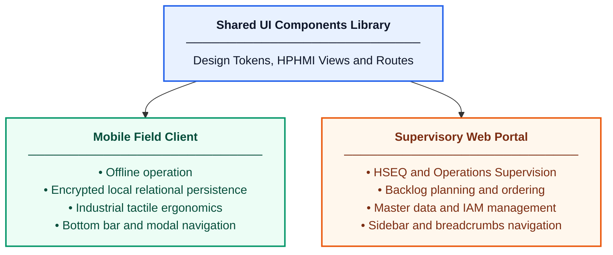
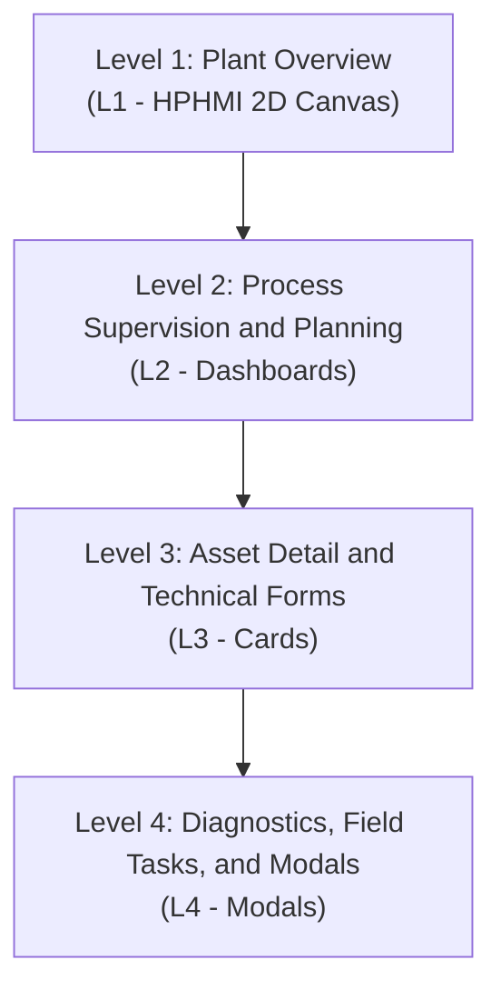
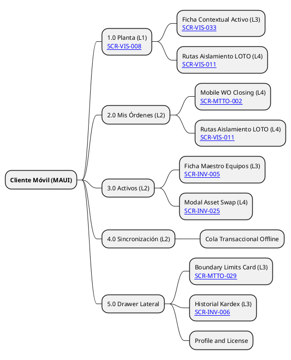
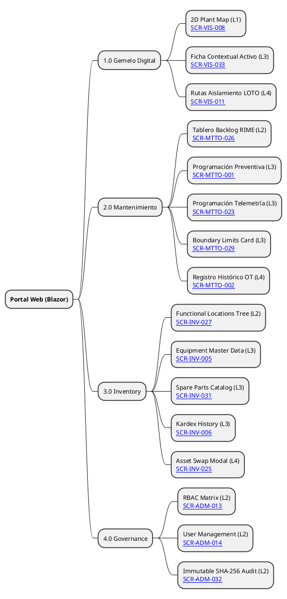
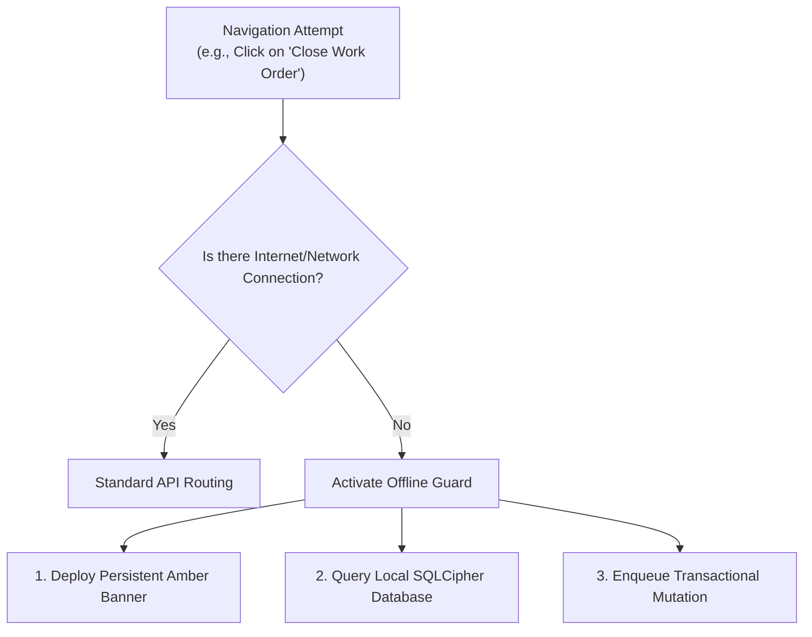
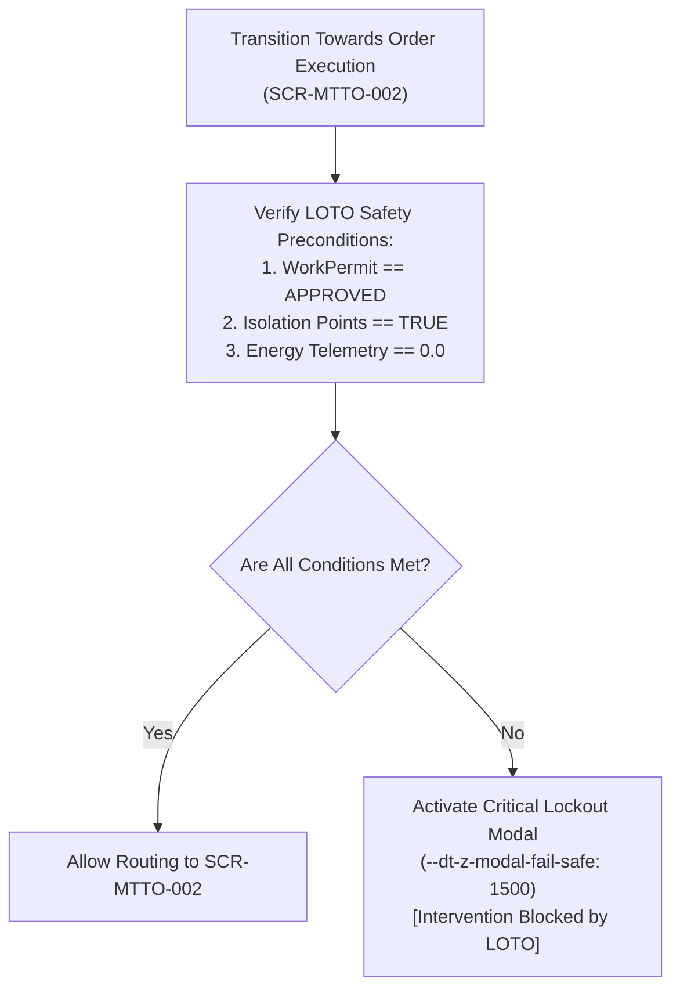

# Information Architecture and Global Navigation Specification

## 1. Scope

This document establishes the information architecture and the global navigation model for the EAM Digital Twin (DTEAM). It defines the hierarchical screen structure conforming to the **ANSI/ISA-101.01-2015** standard, functional distribution across platforms, role-based access control (RBAC) rules, and critical navigation guards for industrial safety and offline field operation.

The scope is limited to the 16 screens comprising the initial version of the product, ensuring traceability with approved use cases and domain models.

---

## 2. Client Topology 

According to architecture decision record [[ADR-004]], the user interface is distributed across two executable environments consuming a shared library of visual components, presentation logic, and design contracts:

### 2.1. Mobile Field Client
* **Operational Objective:** Work order execution, physical inspection of plant assets, component rotation, and validation of LOTO safety isolation routes.
* **Navigation Pattern:** Flat structure optimized for industrial portable devices (tablets and data collectors). Uses a bottom navigation bar with 4 main accesses, collapsible side panel for secondary tools, and full-screen modal dialog flows for high-risk tasks.
* **Device Orientation Adaptation:** Upon detecting a physical orientation change from portrait (`--dt-breakpoint-md`) to landscape (`--dt-breakpoint-lg`), bottom contextual containers (*Bottom Sheets*) automatically transition to fixed right-side panels according to the `--dt-layout-drawer-width` dimensional token, preventing vertical overlap over spatial diagrams and dense forms.

### 2.2. Web Portal Client 
* **Operational Objective:** Executive HSEQ supervision, ISO 14224 taxonomic catalog administration, maintenance backlog prioritization via RIME methodology, inventory management, and immutable audit inspection.
* **Navigation Pattern:** Deep hierarchical structure for high-resolution desktop screens (1920x1080). Uses a collapsible left sidebar with multilevel menus, top bar with breadcrumbs, network status, and contextual panels divided into columns.

---

## 3. Navigation Hierarchy

The **ANSI/ISA-101.01** standard requires industrial interfaces to be organized into four hierarchical display levels to prevent cognitive fatigue and ensure situational awareness.

### 3.1. Level 1: Plant Overview (L1 - Area / Overview)
Macro screens providing a holistic, uninterrupted view of the industrial plant. They apply the 90% neutral grays HPHMI rule to highlight only alarm conditions.

* **[[SCR-VIS-008]] — 2D Plant Map:** Scalable vector graphic canvas (SVG) adopting the *Simplified Plot Plan / Process Overview* format in a neutral scale, representing the spatial distribution of the plant, main assets, operating states, and active work permit layers. Traceable with **[[UC-VIS-008]]** and **[[UC-VIS-033]]**.

### 3.2. Level 2: Process Supervision and Planning (L2 - Unit / Process)
Intermediate control screens for supervisors, planners, and auditors. They consolidate aggregated information, hierarchy trees, and performance metrics.

* **[[SCR-MTTO-026]] — RIME Backlog Dashboard:** Objective prioritization view of requests and work orders based on the product of Asset Criticality by Work Class. Traceable with **[[UC-MTTO-026]]**.
* **[[SCR-INV-027]] — Functional Locations Tree:** Hierarchical structure of ISO 14224 levels 1 to 5 for spatial process navigation. Traceable with **[[UC-INV-027]]**.
* **[[SCR-ADM-013]] — Roles and Permissions Matrix (RBAC):** Security configuration panel for assigning access privileges and segregation of duties. Traceable with **[[UC-ADM-013]]**.
* **[[SCR-ADM-014]] — User Management:** Administration view for user account lifecycle, operational status, and security lockout. Traceable with **[[UC-ADM-014]]**.
* **[[SCR-ADM-032]] — Immutable Audit Log Viewer:** Historical records query interface with chained cryptographic hash verification (SHA-256). Traceable with **[[UC-ADM-032]]**.

### 3.3. Level 3: Asset Detail and Technical Forms (L3 - Equipment Detail)
Screens dedicated to detailed inspection of a specific equipment unit (ISO 14224 Level 6) or the formal preparation of maintenance interventions.

* **[[SCR-VIS-033]] — Asset Inspection Card:** Detailed contextual view of the selected equipment with telemetry data, structural breakdown, and recent history. Traceable with **[[UC-VIS-033]]**.
* **[[SCR-MTTO-001]] — Preventive Scheduling Form:** Configuration interface for cyclic maintenance plans by calendar, operating hours, or starts. Traceable with **[[UC-MTTO-001]]**.
* **[[SCR-MTTO-023]] — Telemetry Scheduling Form:** Configuration of condition-based maintenance (CBM) rules driven by IoT sensors. Traceable with **[[UC-MTTO-023]]**.
* **[[SCR-MTTO-029]] — Asset Boundary Limits Card:** Technical definition of the physical limits of the equipment (battery limits) for cost control. Traceable with **[[UC-MTTO-029]]**.
* **[[SCR-INV-005]] — Equipment Master Data Card:** Master record of the physical asset with manufacturer specifications, purchase date, and operational status. Traceable with **[[UC-INV-005]]**.
* **[[SCR-INV-006]] — Movements and Kardex History:** Transactional record of receipts, issues, and returns of materials and spare parts associated with the asset. Traceable with **[[UC-INV-006]]**.
* **[[SCR-INV-031]] — Spare Parts Master Catalog:** Centralized management of spare parts and supplies with definition of inventory policies. Traceable with **[[UC-INV-031]]**.

### 3.4. Level 4: Diagnostics, Field Tasks, and Modal Dialogs (L4 - Diagnostics / Tasks)
Specialized interfaces for atomic execution, safety verification at the point of work, and interruptive modal dialogs.

* **[[SCR-VIS-011]] — LOTO Isolation and Lockout Routes Viewer:** Graphical interface for verifying energy isolation points before intervening on equipment. Traceable with **[[UC-VIS-011]]**.
* **[[SCR-MTTO-002]] — Mobile Work Order Closing:** Field technical capture form for logging working hours, consumed spare parts, and ISO 14224 failure codes. Traceable with **[[UC-MTTO-002]]**.
* **[[SCR-INV-025]] — Asset Rotation Modal (Asset Swap):** Transactional dialog for the physical dismounting of equipment and mounting of a replacement unit at the functional location. Traceable with **[[UC-INV-025]]**.

---

## 4. Information Architecture Tree

### 4.1. Navigation Structure — Mobile Client

### 4.2. Navigation Structure — Web Portal Client

---

## 5. Transition Matrix and Access Control (RBAC)

The following table defines the transition rules between screens, triggering events, and authorized user roles to execute each route in the application:

| Origin Screen | Triggering Event / UI Action | Destination Screen | ISA-101 Level | Authorized Roles |
| :-------------------- | :------------------------------------------------------- | :------------------------- | :-----------: | :-------------------------------------------- |
| [[SCR-VIS-008]]       | Asset Selection on 2D Canvas                         | [[SCR-VIS-033]]            |  L1 $\to$ L3  | All Roles                               |
| [[SCR-VIS-008]]       | LOTO Layer Selection on 2D Canvas                      | [[SCR-VIS-011]]            |  L1 $\to$ L4  | Technician, Supervisor, HSEQ, Reliability Eng. |
| `Any (Global)` | Press `Ctrl + K`, `/` or Tap on tactile search button | `Fuzzy Search Modal` |      L2       | All Roles                               |
| [[SCR-VIS-033]]       | Click on "Verify LOTO Isolation"                     | [[SCR-VIS-011]]            |  L3 $\to$ L4  | Technician, Supervisor, HSEQ                     |
| [[SCR-VIS-033]]       | Click on "View Data Sheet"                              | [[SCR-INV-005]]            |  L3 $\to$ L3  | All Roles                               |
| [[SCR-VIS-033]]       | Click on "Start WO Execution"                           | [[SCR-MTTO-002]]           |  L3 $\to$ L4  | Technician, Supervisor                           |
| [[SCR-MTTO-026]]      | Row Selection in RIME Backlog                        | [[SCR-MTTO-001]]           |  L2 $\to$ L3  | Planner, Supervisor, Reliability Eng.  |
| [[SCR-MTTO-026]]      | Click on "Schedule by Sensor"                           | [[SCR-MTTO-023]]           |  L2 $\to$ L3  | Planner, Reliability Eng.              |
| [[SCR-MTTO-001]]      | Click on "Verify Spare Parts"                            | [[SCR-INV-031]]            |  L3 $\to$ L3  | Planner, Warehouse Manager                    |
| [[SCR-MTTO-002]]      | Click on "Rotate Dismounted Equipment"                        | [[SCR-INV-025]]            |  L4 $\to$ L4  | Technician, Supervisor, Jefe Almacén             |
| [[SCR-MTTO-002]]      | Technical Closing Confirmation                              | [[SCR-MTTO-026]]           |  L4 $\to$ L2  | Technician, Supervisor                           |
| [[SCR-INV-027]]       | Location Node Selection                           | [[SCR-INV-005]]            |  L2 $\to$ L3  | All Roles                               |
| [[SCR-INV-005]]       | Click on "Check Kardex"                               | [[SCR-INV-006]]            |  L3 $\to$ L3  | Warehouse Manager, Planner, Auditor           |
| [[SCR-INV-005]]       | Click on "Define Boundaries"                              | [[SCR-MTTO-029]]           |  L3 $\to$ L3  | Ing. Confiabilidad, Planificador              |
| [[SCR-INV-005]]       | Click on "Physical Replacement"                               | [[SCR-INV-025]]            |  L3 $\to$ L4  | Technician, Supervisor, Jefe Almacén             |
| [[SCR-ADM-014]]       | Click on "Edit Privileges"                             | [[SCR-ADM-013]]            |  L2 $\to$ L2  | Administrator                                 |
| [[SCR-ADM-013]]       | Click on "Audit Modification"                           | [[SCR-ADM-032]]            |  L2 $\to$ L2  | Administrator, Auditor, Gerente               |

---

## 6. Interruption Flows and Safety Guards

To ensure compliance with the Architecturally Significant Requirements ([[DT-ARQ-ASR-001#1. Offline-First Operation and Partition Tolerance|ASR-001]] and [[DT-ARQ-ASR-001#2. Real-Time LOTO Safety and Fail-Safe|ASR-002]]), the frontend client routing module implements two interruptive navigation guards that invalidate standard transitions when anomalous conditions are detected in the field.

### 6.1. Offline Operation Guard 

On the mobile client, the loss of wireless network signal does not stop the navigation of field functions.

* **Visual Behavior:** A persistent upper amber banner (`--dt-color-alarm-warning`) is immediately activated, accompanied by the WCAG disconnection icon.
* **Routing Restriction:** Access to centralized master data administration screens is blocked ([[SCR-ADM-013]], [[SCR-ADM-014]], [[SCR-ADM-032]]). 
* **Operational Permissiveness:** Full navigation and editing are allowed on field execution screens ([[SCR-MTTO-002]], [[SCR-VIS-011]], [[SCR-INV-025]]), performing reads and writes on the encrypted local database ([[TR-002]]). Generated mutations are logged in a transactional synchronization queue for subsequent dispatch upon network restoration.

### 6.2. LOTO Lockout and Fail-Safe Guard 

In compliance with the **ISO 45001 (Clause 8.1)** standard and the **ASR-002** requirement, the system programmatically prevents a technician from starting the execution of a work order if residual energy risks exist in the equipment.

* **Activation Trigger:** Executed automatically before transitioning to the closing/execution screen ([[SCR-MTTO-002]]) or when attempting to change the order status to `IN_PROGRESS`.
* **Lockout Conditions:**
  1. Work Permit status (`WorkPermit.status`) other than `APPROVED`.
  2. Presence of unverified isolation points (`is_isolated = FALSE` in the `WorkOrderIsolation` table).
  3. Real-time telemetry reading above zero or network heartbeat loss (greater than 2 seconds) without a validated Cryptographic Manual Override.
* **Screen Behavior:** Interrupts navigation and deploys a red blocking modal overlay (`--dt-color-alarm-critical`) at the maximum stacking level (`--dt-z-modal-fail-safe` = `1500`). This window is **non-dismissible**; it cannot be closed or bypassed via gestures or keyboard until the field safety conditions are physically rectified and verified by the system.
