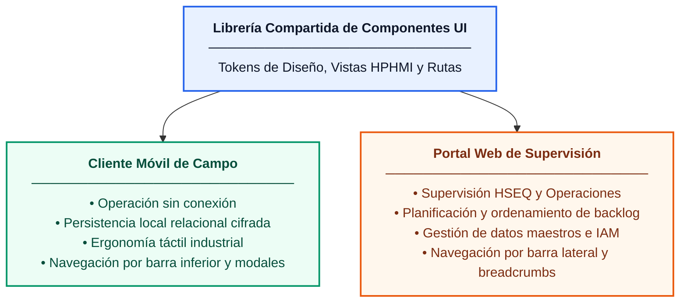
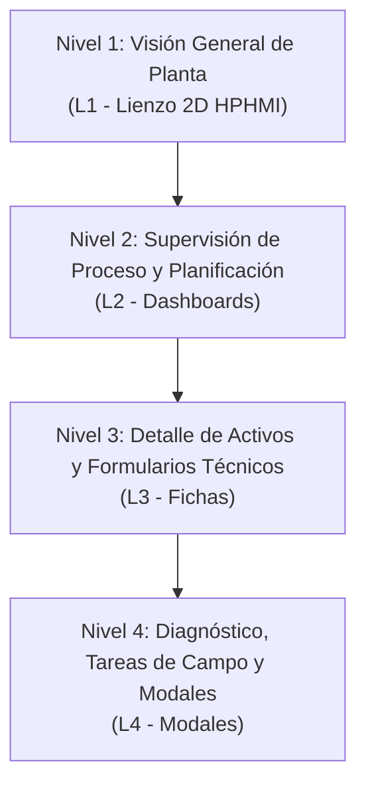
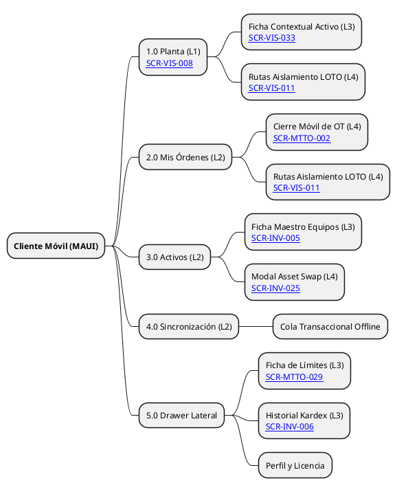
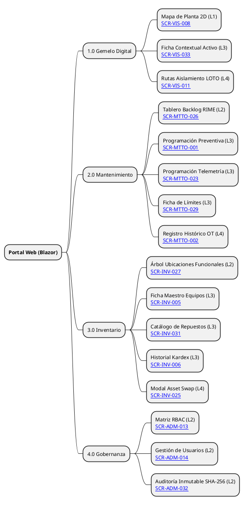
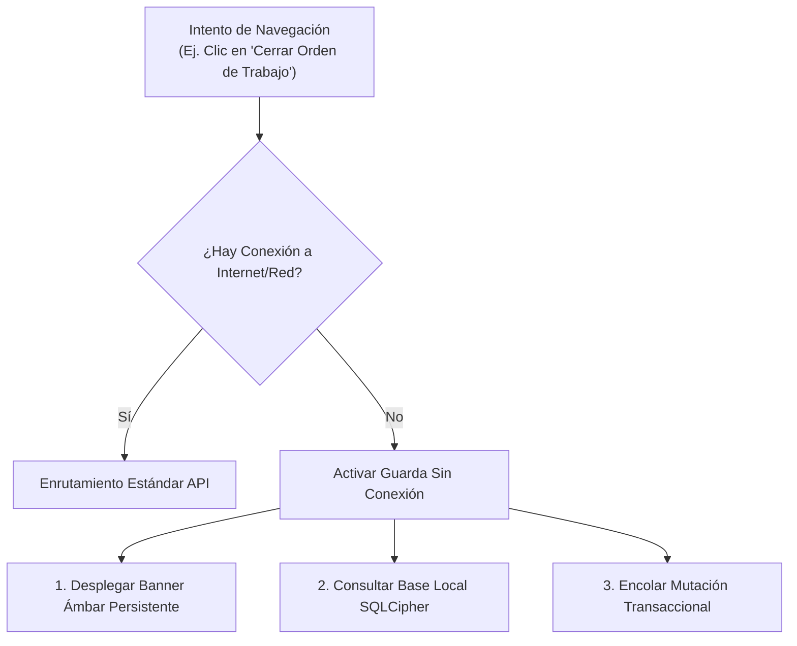
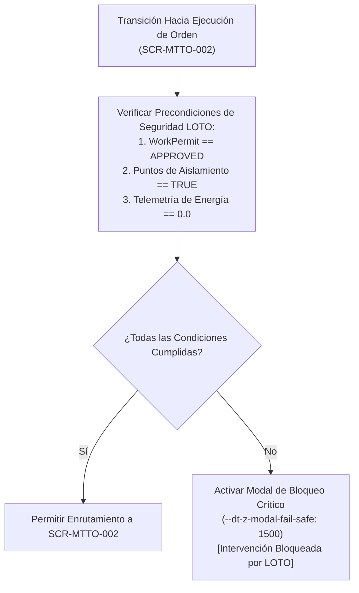

# Especificación de Arquitectura de la Información y Navegación Global

## 1. Alcance

Este documento establece la arquitectura de información y el modelo de navegación global para el Gemelo Digital EAM (DTEAM). Define la estructura jerárquica de pantallas conforme a la norma **ANSI/ISA-101.01-2015**, la distribución funcional entre plataformas, las reglas de control de acceso basado en roles (RBAC) y las guardas de navegación críticas para la seguridad industrial y la operación en campo sin conexión.

El alcance está delimitado a las 16 pantallas que componen la versión inicial del producto, garantizando trazabilidad con los casos de uso aprobados y los modelos de dominio.

---

## 2. Topología de Clientes 

De acuerdo con el registro de decisión de arquitectura [[ADR-004]], la interfaz de usuario se distribuye en dos entornos ejecutables que consumen una librería compartida de componentes visuales, lógica de presentación y contratos de diseño:

### 2.1. Cliente Móvil de Campo
* **Objetivo Operacional:** Ejecución de órdenes de trabajo, inspección física de activos en planta, rotación de componentes y validación de rutas de aislamiento de seguridad LOTO.
* **Patrón de Navegación:** Estructura plana optimizada para dispositivos portátiles industriales (tabletas y colectores de datos). Utiliza barra de navegación inferior de 4 accesos principales, panel lateral desplegable para herramientas secundarias y flujos de diálogo modales de pantalla completa para tareas de alto riesgo.
* **Adaptación a Orientación de Dispositivo:** Al detectar un cambio de orientación física de vertical (`--dt-breakpoint-md`) a horizontal (`--dt-breakpoint-lg`), los contenedores contextuales inferiores (*Bottom Sheets*) transicionan automáticamente a paneles laterales derechos fijados según el token dimensional `--dt-layout-drawer-width`, evitando el solapamiento vertical sobre diagramas espaciales y formularios densos.

### 2.2. Cliente Portal Web 
* **Objetivo Operacional:** Supervisión ejecutiva HSEQ, administración del catálogo taxonómico ISO 14224, priorización del backlog de mantenimiento mediante metodología RIME, gestión de inventario e inspección de auditoría inmutable.
* **Patrón de Navegación:** Estructura jerárquica profunda para pantallas de escritorio de alta resolución (1920x1080). Utiliza barra lateral izquierda colapsable con menús multinivel, barra superior con ruta de navegación (breadcrumbs), estado de red y paneles contextuales divididos en columnas.

---

## 3. Jerarquía de Navegación

La norma **ANSI/ISA-101.01** exige la organización de interfaces industriales en cuatro niveles jerárquicos de visualización para prevenir la fatiga cognitiva y garantizar la concienciación situacional.

### 3.1. Nivel 1: Visión General de Planta (L1 - Area / Overview)
Pantallas macro que brindan una visión holística e ininterrumpida de la planta industrial. Aplican la regla HPHMI del 90% de grises neutros para resaltar únicamente condiciones de alarma.

* **[[SCR-VIS-008]] — Mapa de Planta 2D:** Lienzo gráfico vectorial escalable (SVG) que adopta el formato de *Simplified Plot Plan / Process Overview* en escala neutra y representa la distribución espacial de la planta, activos principales, estados de operación y capas de permisos de trabajo activos. Trazable con **[[UC-VIS-008]]** y **[[UC-VIS-033]]**.

### 3.2. Nivel 2: Supervisión de Proceso y Planificación (L2 - Unit / Process)
Pantallas de control intermedio para supervisores, planificadores y auditores. Consolidan información agregada, árboles de jerarquía y métricas de desempeño.

* **[[SCR-MTTO-026]] — Tablero de Backlog RIME:** Vista de priorización objetiva de solicitudes y órdenes de trabajo basada en el producto de Criticidad del Activo por Clase de Trabajo. Trazable con **[[UC-MTTO-026]]**.
* **[[SCR-INV-027]] — Árbol de Ubicaciones Funcionales:** Estructura jerárquica de niveles 1 a 5 de la norma ISO 14224 para la navegación espacial del proceso. Trazable con **[[UC-INV-027]]**.
* **[[SCR-ADM-013]] — Matriz de Roles y Permisos (RBAC):** Panel de configuración de seguridad para asignación de privilegios de acceso y segregación de funciones. Trazable con **[[UC-ADM-013]]**.
* **[[SCR-ADM-014]] — Gestión de Usuarios:** Vista de administración del ciclo de vida de cuentas de usuario, estado operativo y bloqueo de seguridad. Trazable con **[[UC-ADM-014]]**.
* **[[SCR-ADM-032]] — Visor de Registro de Auditoría Inmutable:** Interfaz de consulta de registros históricos con verificación de dispersión criptográfica encadenada (SHA-256). Trazable con **[[UC-ADM-032]]**.

### 3.3. Nivel 3: Detalle de Activos y Formularios Técnicos (L3 - Equipment Detail)
Pantallas dedicadas a la inspección detallada de una unidad de equipo específica (Nivel 6 ISO 14224) o a la preparación formal de intervenciones de mantenimiento.

* **[[SCR-VIS-033]] — Tarjeta de Inspección del Activo:** Vista contextual detallada del equipo seleccionado con datos de telemetría, despiece estructural e historial reciente. Trazable con **[[UC-VIS-033]]**.
* **[[SCR-MTTO-001]] — Formulario de Programación Preventiva:** Interfaz de configuración de planes de mantenimiento cíclicos por calendario, horas de uso o arranques. Trazable con **[[UC-MTTO-001]]**.
* **[[SCR-MTTO-023]] — Formulario de Programación por Telemetría:** Configuración de reglas de mantenimiento basadas en condición (CBM) impulsadas por sensores IoT. Trazable con **[[UC-MTTO-023]]**.
* **[[SCR-MTTO-029]] — Ficha de Límites del Activo:** Definición técnica de límites físicos del equipo (fronteras de batería) para control de costos. Trazable con **[[UC-MTTO-029]]**.
* **[[SCR-INV-005]] — Ficha Técnica Maestro de Equipos:** Registro maestro del activo físico con especificaciones de fabricante, fecha de compra y estado operativo. Trazable con **[[UC-INV-005]]**.
* **[[SCR-INV-006]] — Movimientos e Historial Kardex:** Registro transaccional de ingresos, salidas y devoluciones de materiales y repuestos asociados al activo. Trazable con **[[UC-INV-006]]**.
* **[[SCR-INV-031]] — Catálogo Maestro de Repuestos:** Gestión centralizada de repuestos e insumos con definición de políticas de inventario. Trazable con **[[UC-INV-031]]**.

### 3.4. Nivel 4: Diagnóstico, Tareas de Campo y Diálogos Modales (L4 - Diagnostics / Tasks)
Interfaces especializadas de ejecución atómica, verificación de seguridad en el punto de trabajo y diálogos modales interrumptivos.

* **[[SCR-VIS-011]] — Visor de Rutas de Aislamiento y Bloqueo LOTO:** Interfaz gráfica de verificación de puntos de aislamiento de energía antes de intervenir un equipo. Trazable con **[[UC-VIS-011]]**.
* **[[SCR-MTTO-002]] — Cierre Móvil de Orden de Trabajo:** Formulario de captura técnica en campo para registro de tiempos de trabajo, repuestos consumidos y códigos de falla ISO 14224. Trazable con **[[UC-MTTO-002]]**.
* **[[SCR-INV-025]] — Modal de Rotación de Activo (Asset Swap):** Diálogo transaccional para desmontaje físico de un equipo y montaje de una unidad de reemplazo en la ubicación funcional. Trazable con **[[UC-INV-025]]**.

---

## 4. Árbol de Arquitectura de la Información

### 4.1. Estructura de Navegación — Cliente Móvil

### 4.2. Estructura de Navegación — Cliente Portal Web

---

## 5. Matriz de Transiciones y Control de Acceso (RBAC)

La siguiente tabla define las reglas de transición entre pantallas, los eventos disparadores y los roles de usuario autorizados para ejecutar cada ruta en la aplicación:

| Pantalla de Origen    | Evento Disparador / Acción de UI                         | Pantalla de Destino        | Nivel ISA-101 | Roles Autorizados                             |
| :-------------------- | :------------------------------------------------------- | :------------------------- | :-----------: | :-------------------------------------------- |
| [[SCR-VIS-008]]       | Selección de Activo en Lienzo 2D                         | [[SCR-VIS-033]]            |  L1 $\to$ L3  | Todos los Roles                               |
| [[SCR-VIS-008]]       | Selección de Capa LOTO en Lienzo 2D                      | [[SCR-VIS-011]]            |  L1 $\to$ L4  | Técnico, Supervisor, HSEQ, Ing. Confiabilidad |
| `Cualquiera (Global)` | Pulsar `Ctrl + K`, `/` o Tap en botón de búsqueda táctil | `Modal de Búsqueda Difusa` |      L2       | Todos los Roles                               |
| [[SCR-VIS-033]]       | Clic en "Verificar Aislamiento LOTO"                     | [[SCR-VIS-011]]            |  L3 $\to$ L4  | Técnico, Supervisor, HSEQ                     |
| [[SCR-VIS-033]]       | Clic en "Ver Ficha Técnica"                              | [[SCR-INV-005]]            |  L3 $\to$ L3  | Todos los Roles                               |
| [[SCR-VIS-033]]       | Clic en "Iniciar Ejecución OT"                           | [[SCR-MTTO-002]]           |  L3 $\to$ L4  | Técnico, Supervisor                           |
| [[SCR-MTTO-026]]      | Selección de Fila en Backlog RIME                        | [[SCR-MTTO-001]]           |  L2 $\to$ L3  | Planificador, Supervisor, Ing. Confiabilidad  |
| [[SCR-MTTO-026]]      | Clic en "Programar por Sensor"                           | [[SCR-MTTO-023]]           |  L2 $\to$ L3  | Planificador, Ing. Confiabilidad              |
| [[SCR-MTTO-001]]      | Clic en "Verificar Repuestos"                            | [[SCR-INV-031]]            |  L3 $\to$ L3  | Planificador, Jefe Almacén                    |
| [[SCR-MTTO-002]]      | Clic en "Rotar Equipo Desmontado"                        | [[SCR-INV-025]]            |  L4 $\to$ L4  | Técnico, Supervisor, Jefe Almacén             |
| [[SCR-MTTO-002]]      | Confirmación Cierre Técnico                              | [[SCR-MTTO-026]]           |  L4 $\to$ L2  | Técnico, Supervisor                           |
| [[SCR-INV-027]]       | Selección de Nodo de Ubicación                           | [[SCR-INV-005]]            |  L2 $\to$ L3  | Todos los Roles                               |
| [[SCR-INV-005]]       | Clic en "Consultar Kardex"                               | [[SCR-INV-006]]            |  L3 $\to$ L3  | Jefe Almacén, Planificador, Auditor           |
| [[SCR-INV-005]]       | Clic en "Definir Fronteras"                              | [[SCR-MTTO-029]]           |  L3 $\to$ L3  | Ing. Confiabilidad, Planificador              |
| [[SCR-INV-005]]       | Clic en "Reemplazo Físico"                               | [[SCR-INV-025]]            |  L3 $\to$ L4  | Técnico, Supervisor, Jefe Almacén             |
| [[SCR-ADM-014]]       | Clic en "Editar Privilegios"                             | [[SCR-ADM-013]]            |  L2 $\to$ L2  | Administrador                                 |
| [[SCR-ADM-013]]       | Clic en "Auditar Modificación"                           | [[SCR-ADM-032]]            |  L2 $\to$ L2  | Administrador, Auditor, Gerente               |

---

## 6. Flujos de Interrupción y Guardas de Seguridad

Para garantizar el cumplimiento de los Requisitos Arquitectónicamente Significativos ([[DT-ARQ-ASR-001#1. Operación Offline-First y Tolerancia a Particiones|ASR-001]] y [[DT-ARQ-ASR-001#2. Seguridad LOTO en Tiempo Real y Falla Segura|ASR-002]]), el módulo de enrutamiento del cliente frontend implementa dos guardas de navegación interrumptivas que invalidan la transición estándar cuando se detectan condiciones anómalas en campo.

### 6.1. Guarda de Operación Sin Conexión 

En el cliente móvil, la pérdida de señal de red inalámbrica no detiene la navegación de las funciones de campo.

* **Comportamiento Visual:** Se activa de forma inmediata un banner superior persistente en color ámbar (`--dt-color-alarm-warning`), acompañado por el icono WCAG de desconexión.
* **Restricción de Enrutamiento:** Se bloquea el acceso a pantallas de administración de datos maestros centralizados ([[SCR-ADM-013]], [[SCR-ADM-014]], [[SCR-ADM-032]]). 
* **Permisividad Operativa:** Se permite la navegación y edición completa en las pantallas de ejecución de campo ([[SCR-MTTO-002]], [[SCR-VIS-011]], [[SCR-INV-025]]), realizando la lectura y escritura sobre la base de datos local cifrada ([[TR-002]]). Las mutaciones generadas se registran en una cola de sincronización transaccional para su posterior envío al restablecer la red.

### 6.2. Guarda de Bloqueo LOTO y Falla Segura 

En cumplimiento de la norma **ISO 45001 (Cláusula 8.1)** y el requisito **ASR-002**, el sistema impide programáticamente que un técnico inicie la ejecución de una orden de trabajo si existen riesgos de energía residual en el equipo.

* **Disparador de Activación:** Se ejecuta automáticamente antes de transicionar a la pantalla de cierre/ejecución ([[SCR-MTTO-002]]) o al intentar cambiar el estado de la orden a `IN_PROGRESS`.
* **Condiciones de Bloqueo:**
  1. Estado del Permiso de Trabajo (`WorkPermit.status`) diferente de `APPROVED`.
  2. Presencia de puntos de aislamiento no verificados (`is_isolated = FALSE` en la tabla `WorkOrderIsolation`).
  3. Lectura de telemetría en tiempo real por encima de cero o pérdida del latido de red (*heartbeat* mayor a 2 segundos) sin anulación manual criptográfica validada.
* **Comportamiento en Pantalla:** Interrumpe la navegación y despliega una superposición modal bloqueante roja (`--dt-color-alarm-critical`) en el nivel de apilamiento máximo (`--dt-z-modal-fail-safe` = `1500`). Esta ventana es de carácter **no descartable**; no puede ser cerrada ni omitida mediante gestos o teclado hasta que las condiciones de seguridad en campo sean subsanadas físicamente y verificadas por el sistema.
