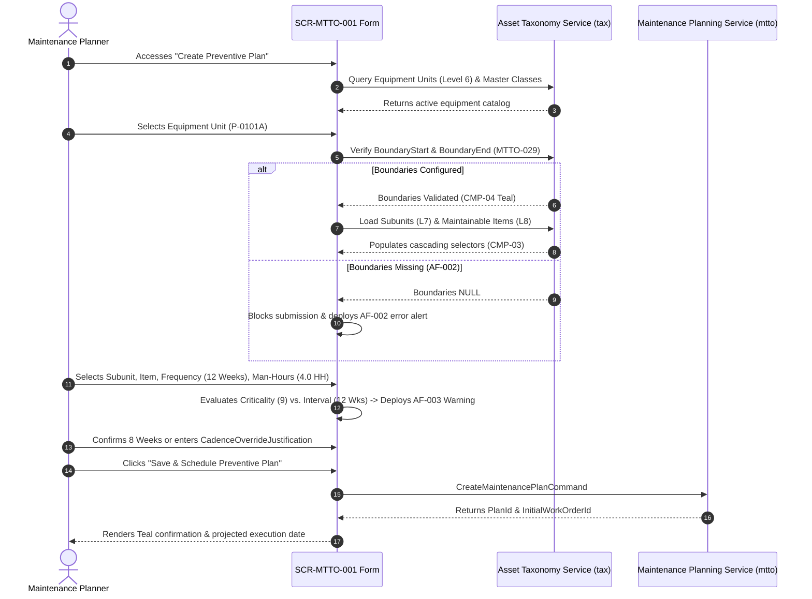

# SCR-MTTO-001: Preventive Maintenance Scheduling Form (Calendar Intervals)

## 1. Purpose and Operational Context

* **View Objective:** Centralized configuration form for creating, calibrating, and scheduling recurring preventive maintenance plans based exclusively on calendar time intervals (days, weeks, months, or years). Links plans to ISO 14224 taxonomic levels (Equipment Unit Level 6, Subunit Level 7, Maintainable Item Level 8), enforces physical battery limits verification ([MTTO-029](../../../requirements/user-stories/mtto/MTTO-029.md)), estimates required labor resources (Wrench Time in Man-Hours), calculates the initial RIME priority score ($Score = \text{Criticality} \times \text{Work Class Weight}$) per [ADR-002](../../../architecture/adr/ADR-002.md), and automatically projects the initial Work Order into `PLANNING` status.
* **Primary Target Persona:** Maintenance Planner defining recurring preventive maintenance cadences, balancing workload hours, and assigning maintenance specialties to prevent catastrophic equipment wear (ISO 55001 §8.1).
* **Secondary Personas:**
  * **Maintenance Supervisor:** Reviews projected preventive work orders and verifies craft availability.
  * **Reliability Engineer:** Verifies taxonomic boundary compliance and receives optimization alerts when inspection cadences on high-criticality equipment units exceed recommended limits.
* **Operational Context:** Planning control rooms, engineering workstations, and supervisory industrial tablets in landscape orientation.
* **Mode of Operation:** Supervisory Technical Configuration mode. Focuses on master plan parameterization, resource allocation, and automated work order projection. Direct DCS/SCADA process control manipulation is strictly excluded.
* **Web Portal Workspace Invariant:** Operates as a Level 3 technical form within the Blazor Web Portal shell (`Pages/Maintenance/CreatePreventivePlanPage.razor`), accessible directly from the Maintenance menu or via drill-down from the RIME Backlog Dashboard ([SCR-MTTO-026](./SCR-MTTO-026.md)).

---

## 2. Visual Artifact

### 2.1. Preventive Maintenance Scheduling Form (Dark Theme)


> *Note: Production UI prototype capture illustrating the Web Portal layout at 1280×800 in Dark Theme. Exhibits the portal navigation sidebar (CMP-01), sticky breadcrumb header and plan context summary sheet (CMP-02), cascading ISO 14224 selector (CMP-03), boundary limit verification badge (CMP-04), calendar cadence controller (CMP-05), labor estimation grid (CMP-07), RIME score decomposition (CMP-09), and grounded action footer (CMP-12).*

### 2.2. Preventive Maintenance Scheduling Form (Light Theme)


> *Note: Production UI prototype capture illustrating the Web Portal layout at 1280×800 in Light Theme.*

---

## 3. Functional Component Inventory

> The base grid, typography, neutral palettes, and minimal tactile contact areas are inherited from [DT-UI-DS-DOC-001](../../DT-UI-DS-DOC-001.md). This inventory defines the canonical components present on the screen, their design tokens, and their architectural scope. Interaction rules and geometric algorithms are specified in Section 5; responsive container adaptations are governed by Section 8.

1. **`CMP-01`: Portal Sidebar Navigation**
   - **Visual Role:** Collapsible persistent sidebar providing access to core modules (Digital Twin, Work Orders, Maintenance Plans, Asset Inventory, Governance).
   - **Design Tokens:**
     - Width (Expanded): `--dt-layout-sidebar-width-expanded`
     - Width (Collapsed): `--dt-layout-sidebar-width-collapsed`
     - Surface: `--dt-color-surface-card`
     - Border: `--dt-color-border-subtle`
     - Active Route Indicator: `--dt-color-state-info`
   - **Architectural Scope:** Hosts shared application routing, collapsible state (`IsCollapsed`), and active route tracking (`ActiveRouteCode = "SCR-MTTO-001"`). Detailed in §8.

2. **`CMP-02`: Form Breadcrumbs, Header & Plan Context Sheet**
   - **Visual Role:** Sticky top bar presenting hierarchical breadcrumb path (*"Maintenance › Preventive Plans › Calendar Scheduling"*), backlink to [SCR-MTTO-026](./SCR-MTTO-026.md), and operator session metadata (`OperatorBadgeCode`, `OperatorDisplayName`), paired with the `PM-CAL` plan context summary header sheet at the top of the primary configuration canvas displaying `MaintenanceMethod` (`PREVENTIVE`), `FrequencyType` (`CALENDAR_TIME`), `SelectedCadence`, and `PlanStatus` (`DRAFT` / `ACTIVE`).
   - **Design Tokens:**
     - Surface: `--dt-color-surface-base`
     - Summary Sheet Surface: `--dt-color-surface-card`
     - Border: `--dt-color-border-subtle`
     - Typography: `--dt-font-body-md`, `--dt-font-caption`, `--dt-font-mono-data`
     - Height: `--dt-control-height-lg`
   - **Architectural Scope:** Establishes spatial orientation, operator traceability, and live plan parameterization summary (`FR-006`).

3. **`CMP-03`: Cascading ISO 14224 Selector**
   - **Visual Role:** Three-tier taxonomic dropdown hierarchy: Equipment Unit Level 6 (`P-0101A`), Subunit Level 7 (`Sealing System`), and Maintainable Item Level 8 (`Mechanical Seal`).
   - **Design Tokens:**
     - Surface: `--dt-color-surface-card`
     - Border: `--dt-color-border-subtle`
     - Control Height: `--dt-control-height-lg`
     - Radius: `--dt-radius-md`
   - **Architectural Scope:** Enforces ISO 14224 taxonomic constraints (`FR-001`, `TR-008`), dynamically filtering child subunits and maintainable items upon parent selection and managing cascading state resets.

4. **`CMP-04`: Boundary Limits Verification Badge**
   - **Visual Role:** Real-time compliance badge verifying whether the selected equipment unit has defined physical battery limits (`BoundaryStart`, `BoundaryEnd` per [MTTO-029](../../../requirements/user-stories/mtto/MTTO-029.md)), paired with a contextual action link to [SCR-MTTO-029](./SCR-MTTO-029.md).
   - **Design Tokens:**
     - Radius: `--dt-radius-full`
     - Valid Surface: `--dt-color-state-success`
     - Critical Block Surface: `--dt-color-alarm-critical`
     - Border: `--dt-color-border-subtle`
   - **Architectural Scope:** Hard-blocks plan registration if battery limits are undefined (`AF-002`), guaranteeing maintenance cost and downtime attribution accuracy.

5. **`CMP-05`: Calendar Cadence Controller**
   - **Visual Role:** Numeric interval input ($1..104$) paired with calendar unit selector (`Weeks`, `Months`, `Days`, `Years`) and tactile capsule frequency preset pills (`Weekly`, `Biweekly`, `Monthly`, `Quarterly`, `Semi-Annual`, `Annual`).
   - **Design Tokens:**
     - Surface: `--dt-color-surface-card`
     - Border: `--dt-color-border-subtle`
     - Active Preset Fill: `--dt-primitive-gray-980` (Light) / `--dt-primitive-gray-10` (Dark)
     - Typography: `--dt-font-mono-data`
     - Control Height: `--dt-control-height-lg`
     - Preset Radius: `--dt-radius-full`
   - **Architectural Scope:** Captures calendar frequency parameters (`FR-002`, [DT-UI-DS-DOC-001 §6.6.2](../../DT-UI-DS-DOC-001.md#662-tactile-pill-actions-presets)) and triggers instantaneous execution date calculation (`CMP-06`).

6. **`CMP-06`: Next Work Order Date Indicator**
   - **Visual Role:** Real-time projected execution date preview calculated from current baseline date and cadence parameters.
   - **Design Tokens:**
     - Surface: `--dt-color-surface-raised`
     - Font: `--dt-font-mono-data`
     - Border: `--dt-color-border-subtle`
   - **Architectural Scope:** Previews `NextWorkOrderDate` (`FR-003`) client-side in $< 50\text{ms}$ without server roundtrips.

7. **`CMP-07`: Labor & Resource Estimation Grid**
   - **Visual Role:** Numeric input for Estimated Active Wrench Time ($0.5..40.0\text{ Man-Hours}$ nominal planning range, extendable to $120.0\text{ Man-Hours}$) and multi-select craft specialty capsule toggles (`Mechanical`, `Electrical`, `Instrumentation`, `Lubrication`, `Condition Monitoring`, etc.).
   - **Design Tokens:**
     - Surface: `--dt-color-surface-card`
     - Border: `--dt-color-border-subtle`
     - Active Specialty Fill: `--dt-primitive-gray-980` (Light) / `--dt-primitive-gray-10` (Dark)
     - Control Height: `--dt-control-height-lg`
     - Specialty Toggle Radius: `--dt-radius-full`
   - **Architectural Scope:** Captures craft specialty and active wrench time allocations, validating positive non-zero values (`AF-001`).

8. **`CMP-08`: Plan Scope & SOP Linkage Textarea**
   - **Visual Role:** Multiline input capturing technical narrative, standard operating procedure (SOP) references, and safety isolation requirements.
   - **Design Tokens:**
     - Surface: `--dt-color-surface-card`
     - Border: `--dt-color-border-subtle`
     - Typography: `--dt-font-body-md`
   - **Architectural Scope:** Stores detailed technical scope dispatched to projected Work Orders.

9. **`CMP-09`: RIME Priority Preview Card**
   - **Visual Role:** Real-time decomposition of equipment criticality ($1..10$), Work Class weight (default 6 for Systematic PM, 7 for Regulated PM), and calculated RIME Score ($C \times W$) with redundant priority badge.
   - **Design Tokens:**
     - Surface: `--dt-color-surface-card`
     - Border: `--dt-color-border-subtle`
     - Typography: `--dt-font-mono-data`
   - **Architectural Scope:** Computes initial RIME triage priority per ISO 55001 planning standards ([ADR-002](../../../architecture/adr/ADR-002.md)) and passes priority rating to the instantiated Work Order.

10. **`CMP-10`: High-Criticality Interval Alert Modal & Advisory Pill**
    - **Visual Role:** Non-intrusive inline advisory capsule pill beneath the cadence preset chips deployed when Equipment Criticality $\ge 8$ and selected interval $> 8\text{ weeks}$, paired with an L4 governance modal dialog intercepted prior to persistence requiring mandatory technical justification ($\ge 15$ characters) or one-click adjustment to $\le 8\text{ weeks}$.
    - **Design Tokens:**
      - Modal Backdrop: `--dt-color-surface-overlay`
      - Modal Surface: `--dt-color-surface-card`
      - Modal Width & Max-Height: `--dt-layout-modal-width`, `--dt-layout-modal-max-height`
      - Border & Advisory Accent: `--dt-color-border-subtle`, `--dt-color-alarm-warning`
      - Radius: `--dt-radius-full` (Advisory Pill), `--dt-radius-xl` (Modal Container)
    - **Architectural Scope:** Implements RCM optimization governance (`AF-003`), enforcing justified exceptions (`CadenceOverrideJustification`) on critical infrastructure without causing layout shift (`CLS = 0`) on the primary form.

11. **`CMP-11`: Projected Work Order Preview Card**
    - **Visual Role:** Read-only preview card displaying the first Work Order to be automatically created in `PLANNING` status upon plan confirmation, paired with a contextual `"Verify Spare Parts"` handoff action to [SCR-INV-031](../inv/SCR-INV-031.md).
    - **Design Tokens:**
      - Surface: `--dt-color-surface-card`
      - Border: `--dt-color-state-info`
      - Typography: `--dt-font-caption`, `--dt-font-mono-data`
    - **Architectural Scope:** Previews initial work order attributes (`ScheduledDate`, `WorkClassWeight`, `Status`, `EstimatedLaborCost`) prior to atomic commit (`FR-005`).

12. **`CMP-12`: Plan Confirmation & Action Bar**
    - **Visual Role:** Grounded footer action bar hosting *"Cancel"* and *"Save & Schedule Preventive Plan"* primary action buttons paired with an inline validation feedback pill.
    - **Design Tokens:**
      - Surface: `--dt-color-surface-card`
      - Border: `--dt-color-border-subtle`
      - Primary CTA: `--dt-color-state-info`
      - Disabled CTA: `--dt-color-state-disabled`
      - Height: `--dt-layout-footer-height`
    - **Architectural Scope:** Enforces single-commit atomic creation of `MaintenancePlan` and initial `WorkOrder` (`NFR-007`); hard-disabled until all mandatory fields and boundary checks are satisfied.

---

## 4. Screen State Catalog

1. **Normal / Empty Form**
   - **Activation Condition:** Planner accesses "Create Preventive Plan" prior to equipment unit selection.
   - **Visual Modification:** Form fields render empty or with default prompts. `CMP-04` renders neutral placeholder badge. Primary commit CTA `CMP-12` is disabled (`--dt-color-state-disabled`).
2. **Asset Selected & Validated**
   - **Activation Condition:** Planner selects a valid Level 6 Equipment Unit with defined battery limits.
   - **Visual Modification:** `CMP-04` displays Teal badge (`--dt-color-state-success`): *"Physical Boundaries Verified (ISO 14224)"*. Subunit and Maintainable Item dropdowns become active. RIME score card `CMP-09` populates with equipment criticality.
3. **Boundary Missing Blocked (`AF-002`)**
   - **Activation Condition:** Selected equipment unit has `BoundaryStart` or `BoundaryEnd` as null or empty (`AF-002`).
   - **Visual Modification:** `CMP-04` displays red status pill (`--dt-color-alarm-critical`): *"Physical Boundaries Missing"*. Bottom action footer displays contextual feedback banner: *"Action blocked: Define physical battery limits in asset catalog prior to scheduling."* Primary CTA `CMP-12` is completely disabled with muted grayscale styling and informative tooltip. Form submission is hard-blocked.
4. **High Criticality Alert & Governance Modal (`AF-003`)**
   - **Activation Condition:** Equipment Criticality $\ge 8$ and selected interval $> 8\text{ weeks}$ (`AF-003`).
   - **Visual Modification:** Subtle advisory capsule pill `CMP-10` activates beneath cadence preset chips: *"Requires technical justification upon save (> 8 weeks on critical asset)"*. When the user clicks *"Save & Schedule Preventive Plan"*, an L4 modal dialog (`CMP-10`) intercepts the workflow over `--dt-color-surface-overlay`, requiring $\ge 15$ characters of technical justification or offering a one-click *"Adjust to 8 Weeks"* remediation action.
5. **Missing Mandatory Fields (`AF-001`)**
   - **Activation Condition:** Planner attempts to submit form without satisfying mandatory constraints (e.g., zero labor hours, unselected item, empty scope) (`AF-001`).
   - **Visual Modification:** Omitted inputs highlight with amber warning outline (`--dt-color-alarm-warning`) and warning icon `#icon-warning`. Inline footer pill indicates: *"Mandatory fields required: Equipment Unit, Subunit, Maintainable Item, Frequency, Man-Hours, Description."*
6. **Saving / Instantiating**
   - **Activation Condition:** Planner activates *"Save & Schedule Preventive Plan"* (and confirms `CMP-10` if applicable).
   - **Visual Modification:** Primary CTA `CMP-12` renders skeleton shimmer and loading indicator (*"Saving Plan and Instantiating WO..."*). Form inputs are locked.
7. **Plan Created (Success)**
   - **Activation Condition:** Atomic persistence of plan and initial work order completes in $< 1\text{s}$ (`NFR-008`).
   - **Visual Modification:** Form displays Teal documentary confirmation alert (`--dt-color-state-success`, `#icon-check`), shows generated Work Order ID (`WO-2026-PLAN-XXXX`), and provides navigation links to *"View Active Plans"* or *"Create Another Plan"*.

---

## 5. Interaction Rules and Data Flow

### 5.1. Initial Load & Lifecycle


```mermaid
sequenceDiagram
    autonumber
    actor Planner as Maintenance Planner
    participant UI as SCR-MTTO-001 Form
    participant TAX as Asset Taxonomy Service (tax)
    participant MTTO as Maintenance Planning Service (mtto)

    Planner->>UI: Accesses "Create Preventive Plan"
    UI->>TAX: Query Equipment Units (Level 6) & Master Classes
    TAX-->>UI: Returns active equipment catalog
    Planner->>UI: Selects Equipment Unit (P-0101A)
    UI->>TAX: Verify BoundaryStart & BoundaryEnd (MTTO-029)
    alt Boundaries Configured
        TAX-->>UI: Boundaries Validated (CMP-04 Teal)
        UI->>TAX: Load Subunits (L7) & Maintainable Items (L8)
        TAX-->>UI: Populates cascading selectors (CMP-03)
    else Boundaries Missing (AF-002)
        TAX-->>UI: Boundaries NULL
        UI->>UI: Blocks submission & deploys AF-002 error alert
    end
    Planner->>UI: Selects Subunit, Item, Frequency (12 Weeks), Man-Hours (4.0 HH)
    UI->>UI: Evaluates Criticality (9) vs. Interval (12 Wks) -> Deploys AF-003 Warning
    Planner->>UI: Confirms 8 Weeks or enters CadenceOverrideJustification
    Planner->>UI: Clicks "Save & Schedule Preventive Plan"
    UI->>MTTO: CreateMaintenancePlanCommand
    MTTO-->>UI: Returns PlanId & InitialWorkOrderId
    UI-->>Planner: Renders Teal confirmation & projected execution date
```

1. **Taxonomic Hierarchy Loading:** When an Equipment Unit (Level 6) is selected, the system filters `AvailableSubunits` where `EquipmentUnitId` matches the selected unit. Selecting a Subunit dynamically loads `AvailableMaintainableItems` associated with the selected `SubunitId` (`FR-001`).
2. **Deterministic Next Date Calculation (`FR-003`):** The system calculates:
   $$\text{NextWorkOrderDate} = \text{CurrentDate} + (\text{IntervalValue} \times \text{UnitMultiplier})$$
   where $\text{UnitMultiplier} = 1\text{ day}$ for `DAYS`, $7\text{ days}$ for `WEEKS`, $30.4375\text{ days}$ for `MONTHS`, and $365.25\text{ days}$ for `YEARS`.
3. **Automatic Work Order Instantiation (`FR-005`):** On plan confirmation, the system dispatches `CreateMaintenancePlanCommand` to persist the active `MaintenancePlan` (`Status = MaintenancePlanStatus.ACTIVE`, `FrequencyType = CALENDAR_TIME`, `MaintenanceMethod = MaintenanceMethod.PREVENTIVE`, `IntervalValue`, `IntervalUnit`, `EstimatedLaborHours`, `CadenceOverrideJustification`, `NextWorkOrderDate`) and automatically instantiates the initial preventive `WorkOrder` via `MaintenancePlan.GenerateWorkOrder(NextWorkOrderDate)` ([DT-DM-DOC-002 §3.2](../../../domain-models/class/DT-DM-DOC-002.md#32-maintenanceplan-aggregate-root)) alongside its prioritized `BacklogItem` triage context:
   * `Status = WorkOrderStatus.PLANNING` (`DT-DM-DOC-001 §4.21`)
   * `MaintenanceMethod = MaintenanceMethod.PREVENTIVE` (`DT-DM-DOC-001 §4.22`)
   * `ScheduledDate = NextWorkOrderDate`
   * `WorkClassWeight = 6` for Systematic PM (`WorkRequest.workClassCode` per `DT-DM-DOC-001 §4.24`, or `7` if Regulated PM)
   * `RimeScore = EquipmentUnit.Criticality * WorkClassWeight` (computed via `IRimeCalculator` per [ADR-002](../../../architecture/adr/ADR-002.md))

---

### 5.2. Form Mechanics & Cascading Selectors

1. **Cascading Reset Policy:** Modifying the Level 6 Equipment Unit automatically clears and resets Subunit and Maintainable Item selections. Modifying Subunit clears Maintainable Item.
2. **Frequency Presets:** The form provides quick-select capsule chips (`CMP-05`) for common industrial cadences: `Weekly` (1 Week), `Biweekly` (2 Weeks), `Monthly` (4 Weeks), `Quarterly` (12 Weeks), `Semi-Annual` (26 Weeks), and `Annual` (52 Weeks).
3. **Spare Parts Verification (`CMP-11`):** Clicking *"Verify Spare Parts"* transitions the user to [SCR-INV-031](../inv/SCR-INV-031.md) with the context of the selected Maintainable Item pre-filtered, allowing the planner to confirm stock levels before finalizing the recurring schedule.

---

### 5.3. Domain Workflows & Validation Rules

#### 5.3.1. Physical Boundaries Validation (AF-002)
1. Per ISO 14224 (Section 5.6) and [MTTO-029](../../../requirements/user-stories/mtto/MTTO-029.md), maintenance costs and scopes cannot be ambiguously assigned.
2. The form checks `BoundaryStart` and `BoundaryEnd` on `EquipmentUnitLookupDto`. If either is null or whitespace:
   * `CMP-04` and the action footer display the `AF-002` error warning: *"Cannot schedule preventive maintenance on an asset without defined physical boundaries (ISO 14224). Request boundary configuration from the Reliability Engineer."*
   * The primary commit CTA (`CMP-12`) is completely disabled.

#### 5.3.2. High-Criticality Interval Warning (AF-003)
1. If $\text{EquipmentCriticality} \ge 8$ and the entered interval converts to $> 8\text{ weeks}$:
   * Advisory pill `CMP-10` activates beneath the cadence chips: *"Requires technical justification upon save (> 8 weeks on critical asset)"*.
   * Upon clicking *"Save & Schedule Preventive Plan"*, the L4 governance modal `CMP-10` intercepts submission: *"For high criticality assets, it is recommended to schedule preventive plans with intervals less than or equal to 8 weeks. Enter a technical justification to proceed with the current frequency."*
   * The Planner can click *"Adjust to 8 Weeks"* to automatically re-parameterize the cadence, or enter a mandatory technical justification ($\ge 15$ characters, persisted in `MaintenancePlan.CadenceOverrideJustification` and audited via [TR-001](../../../requirements/common/TR-001.md)) to preserve the longer interval.

---

## 6. Industrial and Safety Considerations

* **ANSI/ISA-101 HPHMI Compliance ([TR-011](../../../requirements/common/TR-011.md)):** Form enforces the 90/10 grayscale baseline and Anti-Badge-Inflation rules inherited from [DT-UI-DS-DOC-001 §1](../../DT-UI-DS-DOC-001.md#1-scope) and [§6.5](../../DT-UI-DS-DOC-001.md#65-status-badge-counter-discipline-anti-badge-inflation-principle) using neutral surfaces (`--dt-color-surface-base`, `--dt-color-surface-card`). Saturated chromatic color is strictly functional:
  * **Teal** (`--dt-color-state-success` with `#icon-check`) for verified physical boundaries and documentary confirmation of plan creation.
  * **Amber** (`--dt-color-alarm-warning` with `#icon-warning`) for missing mandatory fields (`AF-001`) and cadence optimization alerts (`AF-003`).
  * **Red** (`--dt-color-alarm-critical` with `#icon-ban`) for missing physical battery limits hard-blocks (`AF-002`).
* **Taxonomic Data Hygiene ([TR-008](../../../requirements/common/TR-008.md)):** Prevents generic "free-text" maintenance planning. By enforcing ISO 14224 Levels 6, 7, and 8, maintenance history is cleanly attributed to maintainable items, enabling accurate MTBF and Pareto failure analytics.
* **Wrench Time Estimation:** Labor hours are captured as pure active wrench time, adhering to modern EAM/CMMS engineering best practices.

---

## 7. Frontend Component Contract (Blazor / Razor)

### 7.1. Component Hierarchy & File Mapping

```text
Pages/Maintenance/
└── CreatePreventivePlanPage.razor                     # Root View (SCR-MTTO-001)
    ├── PortalSidebarNav.razor                         # CMP-01: Shared navigation sidebar
    ├── FormBreadcrumbHeader.razor                     # CMP-02: Header, breadcrumb, backlink & plan summary strip
    ├── IsoHierarchyCascadingSelector.razor            # CMP-03: L6 / L7 / L8 cascading dropdowns
    ├── BoundaryComplianceBadge.razor                 # CMP-04: Battery limits verification status
    ├── CalendarCadenceController.razor                # CMP-05: Cadence numeric input, unit picker & preset pills
    ├── NextExecutionDatePreview.razor                 # CMP-06: Dynamic next execution date preview
    ├── LaborEstimationCard.razor                      # CMP-07: Active wrench time and craft specialty toggles
    ├── PlanScopeEditor.razor                          # CMP-08: Scope narrative and SOP reference
    ├── RimePriorityPreview.razor                      # CMP-09: Real-time RIME score breakdown
    ├── HighCriticalityAlertBanner.razor               # CMP-10: Cadence advisory pill & L4 override modal
    ├── ProjectedWorkOrderCard.razor                   # CMP-11: Instantiated WO preview & spare parts handoff
    └── FormActionFooter.razor                         # CMP-12: Grounded footer commit bar
```

---

### 7.2. Physical Component Parameters & DTO Contracts (.NET 10 / C# 14)

#### 7.2.1. `CreatePreventivePlanPage.razor` (Root View)

```csharp
[Parameter]
public Guid? PreselectedEquipmentUnitId { get; set; }

[Parameter]
public string? PreselectedTagNumber { get; set; }
```

#### 7.2.2. Subcomponent Parameter Contracts (`CMP-01` to `CMP-12`)

```csharp
// CMP-01: PortalSidebarNav.razor
[Parameter]
public bool IsCollapsed { get; set; }

[Parameter]
public required string ActiveRouteCode { get; set; } = "SCR-MTTO-001";

[Parameter]
public EventCallback<bool> OnCollapseToggled { get; set; }

// CMP-02: FormBreadcrumbHeader.razor
[Parameter]
public required string OperatorBadgeCode { get; set; }

[Parameter]
public required string OperatorDisplayName { get; set; }

[Parameter]
public string? ActiveAssetTag { get; set; }

[Parameter]
public MaintenancePlanStatus PlanStatus { get; set; } = MaintenancePlanStatus.DRAFT;

[Parameter]
public EventCallback OnBackToBacklogClicked { get; set; }

// CMP-03: IsoHierarchyCascadingSelector.razor
[Parameter]
public required IReadOnlyList<EquipmentUnitLookupDto> AvailableEquipment { get; set; }

[Parameter]
public required IReadOnlyList<SubunitLookupDto> AvailableSubunits { get; set; }

[Parameter]
public required IReadOnlyList<MaintainableItemLookupDto> AvailableMaintainableItems { get; set; }

[Parameter]
public Guid? SelectedEquipmentUnitId { get; set; }

[Parameter]
public EventCallback<Guid?> SelectedEquipmentUnitIdChanged { get; set; }

[Parameter]
public Guid? SelectedSubunitId { get; set; }

[Parameter]
public EventCallback<Guid?> SelectedSubunitIdChanged { get; set; }

[Parameter]
public Guid? SelectedMaintainableItemId { get; set; }

[Parameter]
public EventCallback<Guid?> SelectedMaintainableItemIdChanged { get; set; }

// CMP-04: BoundaryComplianceBadge.razor
[Parameter]
public bool HasDefinedBoundaries { get; set; }

[Parameter]
public string? BoundaryDescription { get; set; }

[Parameter]
public EventCallback OnInspectBoundariesRequested { get; set; }

// CMP-05: CalendarCadenceController.razor
[Parameter]
public int IntervalValue { get; set; } = 12;

[Parameter]
public EventCallback<int> IntervalValueChanged { get; set; }

[Parameter]
public CalendarIntervalUnit IntervalUnit { get; set; } = CalendarIntervalUnit.WEEKS;

[Parameter]
public EventCallback<CalendarIntervalUnit> IntervalUnitChanged { get; set; }

// CMP-06: NextExecutionDatePreview.razor
[Parameter]
public DateOnly CalculatedNextDate { get; set; }

// CMP-07: LaborEstimationCard.razor
[Parameter]
public decimal EstimatedLaborHours { get; set; } = 4.0m;

[Parameter]
public EventCallback<decimal> EstimatedLaborHoursChanged { get; set; }

[Parameter]
public IReadOnlyList<MaintenanceCraft> RequiredCrafts { get; set; } = [MaintenanceCraft.MECHANICAL];

[Parameter]
public EventCallback<IReadOnlyList<MaintenanceCraft>> RequiredCraftsChanged { get; set; }

// CMP-08: PlanScopeEditor.razor
[Parameter]
public string TechnicalDescription { get; set; } = string.Empty;

[Parameter]
public EventCallback<string> TechnicalDescriptionChanged { get; set; }

// CMP-09: RimePriorityPreview.razor
[Parameter]
public int AssetCriticality { get; set; }

[Parameter]
public int WorkClassWeight { get; set; } = 6;

[Parameter]
public int CalculatedRimeScore { get; set; }

// CMP-10: HighCriticalityAlertBanner.razor
[Parameter]
public bool IsAdvisoryVisible { get; set; }

[Parameter]
public bool IsModalOpen { get; set; }

[Parameter]
public string? OverrideJustification { get; set; }

[Parameter]
public EventCallback<string?> OverrideJustificationChanged { get; set; }

[Parameter]
public EventCallback OnAdjustToRecommendedCadence { get; set; }

[Parameter]
public EventCallback OnConfirmOverride { get; set; }

[Parameter]
public EventCallback OnCancelModal { get; set; }

// CMP-11: ProjectedWorkOrderCard.razor
[Parameter]
public required ProjectedWorkOrderPreviewDto ProjectedWorkOrder { get; set; }

[Parameter]
public EventCallback OnVerifySparePartsRequested { get; set; }

// CMP-12: FormActionFooter.razor
[Parameter]
public bool CanSubmit { get; set; }

[Parameter]
public bool IsSubmitting { get; set; }

[Parameter]
public string? ValidationMessage { get; set; }

[Parameter]
public EventCallback OnSavePlanConfirmed { get; set; }

[Parameter]
public EventCallback OnCancelClicked { get; set; }
```

#### 7.2.3. Data Transfer Objects (DTOs) and Enums

```csharp
/// <summary>
/// Calendar-time subset projection of MaintenancePlan.intervalUnit (DT-DM-DOC-001 §4.14).
/// </summary>
public enum CalendarIntervalUnit
{
    DAYS,
    WEEKS,
    MONTHS,
    YEARS
}

public enum MaintenanceMethod
{
    PREVENTIVE,
    PREDICTIVE,
    CONDITION_BASED
}

public enum MaintenanceCraft
{
    MECHANICAL,
    ELECTRICAL,
    INSTRUMENTATION_AND_CONTROL,
    LUBRICATION,
    CONDITION_MONITORING,
    ELECTRONICS,
    WELDING_FABRICATION,
    FACILITIES
}

public enum MaintenancePlanStatus
{
    DRAFT,
    ACTIVE,
    INACTIVE,
    ARCHIVED
}

public enum WorkOrderStatus
{
    PLANNING,
    WAITING_PARTS,
    SCHEDULED,
    IN_PROGRESS,
    SUSPENDED,
    COMPLETE,
    CLOSED
}

public record EquipmentUnitLookupDto
{
    public required Guid EquipmentUnitId { get; init; }
    public required string TagNumber { get; init; }
    public required string Name { get; init; }
    public required string EquipmentClassName { get; init; }
    public required int Criticality { get; init; }
    public bool HasBoundaries { get; init; }
    public string? BoundaryStart { get; init; }
    public string? BoundaryEnd { get; init; }
}

public record SubunitLookupDto
{
    public required Guid SubunitId { get; init; }
    public required Guid EquipmentUnitId { get; init; }
    public required string SubunitName { get; init; }
}

public record MaintainableItemLookupDto
{
    public required Guid MaintainableItemId { get; init; }
    public required Guid SubunitId { get; init; }
    public required string ItemName { get; init; }
}

public record ProjectedWorkOrderPreviewDto
{
    public required string ProjectedWorkOrderNumber { get; init; }
    public required DateOnly ScheduledDate { get; init; }
    public required WorkOrderStatus Status { get; init; }
    public required int RimeScore { get; init; }
    public decimal EstimatedLaborCost { get; init; }
}

public record CreateMaintenancePlanCommand
{
    public required Guid EquipmentUnitId { get; init; }
    public required Guid SubunitId { get; init; }
    public required Guid MaintainableItemId { get; init; }
    public required int IntervalValue { get; init; }
    public required CalendarIntervalUnit IntervalUnit { get; init; }
    public required decimal EstimatedLaborHours { get; init; }
    public required IReadOnlyList<MaintenanceCraft> RequiredCrafts { get; init; }
    public required string TechnicalDescription { get; init; }
    public string? CadenceOverrideJustification { get; init; }
    public required Guid PlannerUserId { get; init; }
}

public record MaintenancePlanSummaryDto
{
    public required Guid PlanId { get; init; }
    public required string EquipmentTag { get; init; }
    public required string MaintainableItemName { get; init; }
    public required string FrequencyDescription { get; init; }
    public required DateOnly NextWorkOrderDate { get; init; }
    public required MaintenancePlanStatus Status { get; init; }
    public required Guid InitialWorkOrderId { get; init; }
    public required int RimeScore { get; init; }
}
```

---

### 7.3. Client-Side DOM & Interop Bridge

1. **Debounced Execution Date Bridge (`ICadenceDateInterop`):**
   - Recalculates `NextWorkOrderDate` instantaneously on the client thread ($< 50\text{ms}$) as interval numbers or units change, preventing UI blocking.
2. **Keyboard Focus & Form Progression (`IFormKeyNavigationInterop`):**
   - Supports natural `Tab` key cycling across inputs, `Enter` to submit when valid, and `Escape` to close the `CMP-10` modal or cancel form edits.

---

## 8. Layout and Responsive Adaptability

### 8.1. Desktop Workstation (`--dt-breakpoint-xl`)
* **Layout Organization:** Full Web Portal shell with expanded navigation sidebar (`--dt-layout-sidebar-width-expanded`); workspace organizes into an asymmetric two-column technical configuration layout within `--dt-layout-form-max-width`. The flexible primary technical canvas hosts the `PM-CAL` plan context summary header (`CMP-02`) and sequential setup cards: Cascading ISO 14224 selector (`CMP-03`), Cadence controller (`CMP-05`), and Labor estimation & scope (`CMP-07`, `CMP-08`). The dedicated right-hand governance inspection rail (`--dt-layout-drawer-width-tablet` / `--dt-layout-drawer-width`) hosts Boundary verification badge (`CMP-04`), Projected Next Work Order Date (`CMP-06`), RIME score preview (`CMP-09`), and Projected Work Order card (`CMP-11`). Sticky action footer `CMP-12` (`--dt-layout-footer-height`) remains grounded at bottom.
* **Ergonomic Rules:** Mouse and keyboard navigation; form controls adhere to `--dt-control-height-lg`; dense legible technical typography (`--dt-font-body-md`, `--dt-font-mono-data`); zero horizontal scroll; zero layout shift (`CLS = 0`).

### 8.2. Industrial Tablet Landscape (`--dt-breakpoint-lg`)
* **Layout Organization:** Navigation sidebar collapses to an icon-only rail (`--dt-layout-sidebar-width-collapsed`); workspace organizes into a fluid dual-column layout preserving the primary canvas alongside the governance inspection rail (`--dt-layout-drawer-width-tablet`) or a compact single-column stacked card sequence on narrow widths; cadence chips wrap naturally; technical cards preserve stacked key-value pairs; permanent sticky action footer (`CMP-12`, `--dt-layout-footer-height`) remains docked.
* **Ergonomic Rules:** Touch targets governed by `--dt-touch-target-mobile` with `--dt-space-2` separation for gloved operation; prominent numeric inputs and cadence preset chips.

### 8.3. Industrial Tablet Portrait (`--dt-breakpoint-md`)
* **Layout Organization:** Single-column vertical stack with full-width touch targets within `--dt-layout-form-max-width`; off-canvas navigation drawer triggered via top brand mark button in `CMP-02`; governance cards flow sequentially beneath configuration cards; bottom scroll clearance enforced via `--dt-layout-footer-clearance`. Sticky action footer `CMP-12` remains thumb-reachable.
* **Ergonomic Rules:** Gloved operation ergonomics with touch targets governed by `--dt-touch-target-mobile`; sticky bottom action footer (`CMP-12`) prevents thumb strain.

---

## 9. Traceability and Requirements Matrix

| Requirement | Addressed in Component | Verification & Implementation Mechanism |
| :--- | :--- | :--- |
| [FR-001](../../../requirements/user-stories/mtto/MTTO-001.md#functional-requirements-fr) | `CMP-03` | Cascading selection of Level 6 equipment unit, Level 7 subunit, and Level 8 maintainable item. |
| [FR-002](../../../requirements/user-stories/mtto/MTTO-001.md#functional-requirements-fr) | `CMP-05` | Plan creation form defines frequency strictly based on calendar time intervals (`CalendarIntervalUnit`). |
| [FR-003](../../../requirements/user-stories/mtto/MTTO-001.md#functional-requirements-fr) | `CMP-06` | Automatically calculates next Work Order date based on selected frequency and baseline. |
| [FR-004](../../../requirements/user-stories/mtto/MTTO-001.md#functional-requirements-fr) | `CMP-04`, `CMP-12` | Blocks saving plan if mandatory fields (equipment, item, frequency, labor hours, boundaries) are missing. |
| [FR-005](../../../requirements/user-stories/mtto/MTTO-001.md#functional-requirements-fr) | `CMP-11`, `CMP-12` | Automatically projects and instantiates first Work Order in `PLANNING` status upon confirmation. |
| [FR-006](../../../requirements/user-stories/mtto/MTTO-001.md#functional-requirements-fr) | `CMP-02`, `CMP-11` | Displays summary of plan tracking attributes (equipment unit, maintainable item, frequency, next date, status). |
| [NFR-007](../../../requirements/user-stories/mtto/MTTO-001.md#non-functional-requirements-nfr) | `CMP-12` | Fault tolerance and offline queuing resilience for planning actions. |
| [NFR-008](../../../requirements/user-stories/mtto/MTTO-001.md#non-functional-requirements-nfr) | `CMP-03`, `CMP-05`, `CMP-06` | Interface responds to user interactions (cascading selection, date calc) in under 1 second. |
| [NFR-009](../../../requirements/user-stories/mtto/MTTO-001.md#non-functional-requirements-nfr) | `CMP-03` | Virtualized catalog loading supporting extensive taxonomy catalogs without UI lag. |
| [TR-001](../../../requirements/common/TR-001.md) | `CMP-10`, `CMP-12` | Immutable Audit: Logs plan creation, initial work order projection, and high-criticality `CadenceOverrideJustification` entries with cryptographic traceability. |
| [TR-005](../../../requirements/common/TR-005.md) | `CMP-01`, `CMP-03` | Encryption in Transit: Transport layer security (TLS/HTTPS) for all RESTful DTO transmissions and API calls. |
| [TR-006](../../../requirements/common/TR-006.md) | `CMP-02`, `CMP-12` | Role-Based Access Control (RBAC): Enforces permissions (`Maintenance Planner`, `Maintenance Supervisor`). |
| [TR-008](../../../requirements/common/TR-008.md) | `CMP-03`, `CMP-04` | ISO 14224 Hierarchy Management and Validation: Enforces taxonomic hierarchy and physical battery limits ([MTTO-029](../../../requirements/user-stories/mtto/MTTO-029.md)). |
| [TR-010](../../../requirements/common/TR-010.md) | `CMP-11`, `CMP-12` | Real-time synchronization: broadcasts generated preventive work order events to connected clients via WebSockets (`< 1s`). |
| [TR-011](../../../requirements/common/TR-011.md) | `CMP-01`..`CMP-12` | ANSI/ISA-101 HPHMI: 90/10 grayscale palette, functional alert color, and redundant coding. |
| [ADR-002](../../../architecture/adr/ADR-002.md) | `CMP-09`, `CMP-11` | Strategy Pattern for RIME Prioritization Engine (`IRimeCalculator` decoupling score calculation). |
| [ADR-005](../../../architecture/adr/ADR-005.md) | `CMP-03`, `CMP-11` | Time-sequential UUIDv7 generation for plan and work order entities. |
